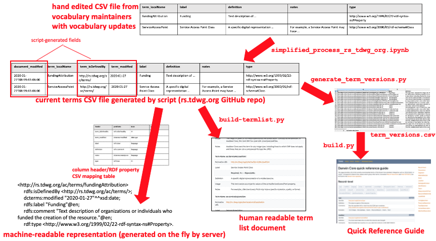

# Workflow for generating a new version of Darwin Core



> [!WARNING]
> *It is highly recommended that you do not hand-edit the raw CSVs with a text editor.* Use Libre Office (NOT Excel). This will reliably open, close, and edit the file while preserving and escaping commas, quotes, etc. and also not mess up the UTF-8 encoding if you set it up properly.

The definitive versions of term definitions are stored in the [rs.tdwg.org repository](https://github.com/tdwg/rs.tdwg.org/).  Generating a new version of Darwin Core requires us to make changes to that repository, then to ensure downstream results are updated (the Darwin Core website, IPT extensions etc).

## Prepare source CSV files

> [!NOTE] 

> These instructions are abbreviated from more detailed instructions [here](https://github.com/tdwg/rs.tdwg.org/blob/master/process/process-vocabulary.md#3-detailed-workflow-steps).

1. Create a source data CSV file for each of the namespaces that has terms that have changed. [This directory](https://github.com/tdwg/rs.tdwg.org/tree/master/process/dwc-revisions/) has examples from previous updates to Darwin Core. You can get the column headers by downloading a CSV for a previous update to that namespace, then deleting all of the data rows. For example, [here](https://github.com/tdwg/rs.tdwg.org/blob/master/process/dwc-revisions/eco-2025-07-10/ecoiri.csv) is an update to terms in the `ecoiri:` namespace and [here](https://github.com/tdwg/rs.tdwg.org/blob/master/process/dwc-revisions/em-2025-06-12/establishmentmeans_terms_2025-06-12.csv) is an update to the `dwcem:` namespace. For historical reasons, different column headers have been used for the main vocabularies and the controlled vocabularies, so that's why you should use a previous example.
2. A source data CSV MUST have a row for each term that has changed (modified or added). For existing terms that have changed, it is safest to start by copying the existing data cells for a term and then modifying them with the changes. The CSVs that contain the existing data for various namespaces are as follows:
   * [`dwc:` terms](https://github.com/tdwg/rs.tdwg.org/blob/master/terms/terms.csv),
   * [`dwciri:` terms](https://github.com/tdwg/rs.tdwg.org/blob/master/iri/iri.csv),
   * [`dc:` terms](https://github.com/tdwg/rs.tdwg.org/blob/master/dc-for-dwc/dc-for-dwc.csv),
   * [`dcterms:` terms](https://github.com/tdwg/rs.tdwg.org/blob/master/dcterms-for-dwc/dcterms-for-dwc.csv),
   * [`establishmentMeans:` terms](https://github.com/tdwg/rs.tdwg.org/blob/master/establishmentMeans/establishmentMeans.csv)
   * [`degreeOfEstablishment:` terms](https://github.com/tdwg/rs.tdwg.org/blob/master/degreeOfEstablishment/degreeOfEstablishment.csv)
   * [`pathway:` terms](https://github.com/tdwg/rs.tdwg.org/blob/master/pathway/pathway.csv)
   * [`ac:` terms](https://github.com/tdwg/rs.tdwg.org/blob/master/ac-for-dwc/ac-for-dwc.csv),
Note that these CSVs contain some columns with machine-generated metadata, so make sure that the data you copy into your source CSV file lines up correctly with the column headers.
3. If a new term is being added, fill in a new row anywhere below the header row. The row order is unimportant.
4. Under normal circumstances, you should not have to add new columns to the tables. If the decision is made to add term metadata properties and thus add columns for them, special care must be taken. This is not for the faint of heart! The new columns must be added to every file used as source data for the various scripts and the column header mapping files also need to be edited. See [this page](https://github.com/tdwg/rs.tdwg.org/blob/master/process/process-vocabulary.md#31-modifying-the-column-header-mapping-file) for more details about the relationship between column headers and the RDF properties they represent. In addition to modifying the existing or default column mapping tables, the various document build scripts would also need to be modified in order to make the new term properties show up on the page. DO NOT ever delete columns! If you want to eliminate values for a property, just leave empty strings in all of the cells of that property's column and they will be ignored by the scripts.

## Preparing the List of Terms document metadata YAML files

5. Each List of Terms document has two YAML files that contain the information necessary to generate the document header: `authors_configuration.yaml` and `document_configuration.yaml`. For existing lists of terms, these files will only need to be edited if there are changes to the authors, or the document title and abstract. If a new List of Terms document is created for a new vocabulary, these files will need to be created by modifying the values of one of the existing files found in an appropriate subdirectory of [this directory](https://github.com/tdwg/rs.tdwg.org/tree/master/process/document_metadata_processing). For more details, see [steps 7 and 8 here](https://github.com/tdwg/rs.tdwg.org/blob/master/process/process-vocabulary.md#3-detailed-workflow-steps). 

## Run the processing script

> [!NOTE]
> Because the `rs.tdwg.org` repository may be managed by people who are not part of the DwC Maintenance Group, it is likely that people who want to generate draft documents for proposed changes will not have write access to `rs.tdwg.org`. In that case, it is possible to generate the drafts using data that has been updated in a fork of `rs.tdwg.org`. Once the proposed changes have been ratified, the source CSV files can be transferred to the TDWG `rs.tdwg.org` repo through a pull request. The `rs.tdwg.org` maintainers (currently Steve Baskauf and Matt Blissett) can then process the data as described below so that it is available from that authoritative source. For details of this process, see the [Generating drafts](https://github.com/tdwg/rs.tdwg.org/blob/master/process/process-vocabulary.md#23-generating-drafts) summary.

The details of the following steps are [here](https://github.com/tdwg/rs.tdwg.org/blob/master/process/process-vocabulary.md#3-detailed-workflow-steps).

6. Create a fork of the [rs.tdwg.org repo](https://github.com/tdwg/rs.tdwg.org). We have been saving copies of the changes in [this directory](https://github.com/tdwg/rs.tdwg.org/tree/master/process/dwc-revisions) so that we can easily see what's been changed for each past version. We create a dated subdirectory for each revision so that it's easier to see what changes were made in past updates.
7. You need to have two YAML files before starting: config.yaml and vocab.yaml . There are examples in the saved data folders. Provide an appropriate path as a value for the `modifications_file_path` key for each namespace in the configuration file [config.yaml](https://github.com/tdwg/rs.tdwg.org/blob/master/process/config.yaml) so that the path points to the subdirectory and filename of the source CSV for changes in that namespace. We have been saving copies of these configuration files with each update in the appropriate update subfolder, so you can look at [the configuration file that goes along with the CSV files in the same directory](https://github.com/tdwg/rs.tdwg.org/blob/master/process/dwc-revisions/dwc-revisions-2023-09-18/config.yaml). Only include data for the namespaces that will be updated.
8. If you need to add or modify the `authors_configuration.yaml` or `document_configuration.yaml` files containing metadata about the List of Terms document, place the modified files in an appropriately named subdirectory of the [document_metadata_processing](https://github.com/tdwg/rs.tdwg.org/tree/master/process/document_metadata_processing) directory. 
9. When all of the source files are in place, make a commit, then create a working branch of the master. This will allow you to view drafts of the documents while retaining the ability to go back to the master if edits of the source data are necessary, and to maintain a copy of the repository containing only the source files.
10. Run the [processing script](https://github.com/tdwg/rs.tdwg.org/blob/master/process/process.py) from the same directory as the configuration files. It's good to look at the diffs for all of the files to make sure that they look sensible.
11. **Dublin Core changes only.** There are some manual edits that need to be made if there are changes to either of the Dublin Core namespace terms. The versions don't get handled very automatically, so make the same changes to the [dcterms: version CSV](https://github.com/tdwg/rs.tdwg.org/blob/master/dcterms-for-dwc-versions/dcterms-for-dwc-versions.csv) or [dc: version CSV](https://github.com/tdwg/rs.tdwg.org/blob/master/dc-for-dwc-versions/dc-for-dwc-versions.csv) as were made to the main term CSVs.
12. **Dublin Core changes only.** The Dublin Core versions also need to be manually added for the new termlist version in the [termlist versions members CSV](https://github.com/tdwg/rs.tdwg.org/blob/master/term-lists-versions/term-lists-versions-members.csv). In the future, this may get automated. The term-list-versions-replacements.csv also must be manually updated.
13. Run the [document metadata processing script](https://github.com/tdwg/rs.tdwg.org/blob/master/process/document_metadata_processing/tdwg_docs_metadata_update.py). See [these notes](https://github.com/tdwg/rs.tdwg.org/blob/master/process/process-vocabulary.md#5-managing-documents-metadata-via-python-script) for more information. Review the diffs carefully to make sure everything is OK.
14. Push the branch to GitHub. It can then be used to generate drafts by using appropriate command line options with the build script.
15. If this is the final processing prior to ratification, create a pull request to merge the master (not the branch containing the processed data) from the fork to the TDWG rs.tdwg.org, with a comment that the changes are going to the Executive Committee for ratification. When ratification is attained, the `rs.tdwg.org` maintainers will update the `config.yaml` file with the final ratification date and run the processing scripts. The updated data in the rs.tdwg.org repo can then be used by the DwC Maintenance Group to build the final List of Terms document.
16. The structure and order of listing of terms in the Quick Reference Guide and derivative CSVs is controlled by the file [qrg-list.csv](https://github.com/tdwg/dwc/blob/master/build/qrg-list.csv). It is very sensitive to the position of the class terms, which controls the division of the QRG into sections. Also, `http://rs.tdwg.org/dwc/iri/behavior` must be the first term in the section that will be labeled "Use with IRI". So it must be edited with some care. If new terms are added, their IRIs must be added in the proper place in this document in order for them to appear in the QRG and derivative CSVs. Make a commit before proceding so that your edits to `qrg-list.csv` will be saved if you need to revert.

## Update the Darwin Core website, extensions and so on

17. Create a branch of the [Darwin Core repo](https://github.com/tdwg/dwc).
18. There is a script called [update_previous_doc.py](https://github.com/tdwg/dwc/blob/master/build/update_previous_doc.py) that must be run before actually building the term list. It requires the updated documents metadata uploaded to rs.tdwg.org in step 10 above. It takes the current document (index.md) and transforms it into a previous version (named by the version date). There are two command line arguments that are required `--slug`, which provides the last part of the document URL, and `--dir`, which gives the name of the directory within the process/document_metadata_processing/ folder of the rs.tdwg.org GitHub repo that contains the document_configuration.yaml file. If you are building the List of Terms from a branch, provide the GitHub user name using the `--ghuser` argument (default "tdwg") and the branch using the `--branch` argument (default "master"). If you are building from the final data in TDWG's rs.tdwg.org repo, omit the last two arguments. **Important note:** if you are updating several List of Terms documents, you need to run this script for each document before proceeding to avoid overwriting the past version before it gets renamed.

19. Run the three scripts (in any order) and check the diffs for the newly generated files.  As with the previous script, if the branch is other than the master, use the `--branch` command line option to specify a different branch and the `--ghuser` option if building from a fork. **NOTE:** when making drafts for proofreading or review by the Executive, only the build-webpages.py script needs to be run.
   i. [build-csv_derivatives.py](https://github.com/tdwg/dwc/blob/master/build/build-csv_derivatives.py) builds the derivative CSV files in the [dist/](https://github.com/tdwg/dwc/tree/master/dist) directory.
   ii. [build-webpages.py](https://github.com/tdwg/dwc/blob/master/build/build-webpages.py) updates the website documents (HTML and Markdown) in the [docs/](https://github.com/tdwg/dwc/tree/master/docs) directory.
   iii. [build-term_versions.py](https://github.com/tdwg/dwc/blob/master/build/build-term_versions.py) updates the [term_versions.csv](https://github.com/tdwg/dwc/blob/master/vocabulary/term_versions.csv) file in the [vocabulary/](https://github.com/tdwg/dwc/tree/master/vocabulary) directory.
20. Create a pull request for the new branch.
21. When the branch has been reviewed carefully, merge the branch. The new pages should be live as soon as Jekyll rebuilds them on GitHub.
22. Prompt GBIF to update the Darwin Core Archive extensions in https://rs.gbif.org, if necessary by opening an issue in [the rs.gbif.org repository](https://github.com/gbif/rs.gbif.org).

## Build scripts

The build scripts `build-csv_derivatives.py`, `build-webpages.py` and `build-term_versions.py` use as input the [rs.tdwg.org](http://github.com/tdwg/rs.tdwg.org) repository, either online (branch given by `--branch`) or local (path given by `--rs-path`).

The `build-webpages.py` script also uses header information from `*/termlist-header.en.md` and `termlist-footer.en.md`. The constructed Markdown documents are saved as `/docs/list/index.md`, `/docs/em/index.md`, `/docs/doe/index.md` and `/docs/pathway/index.md`.  In addition it builds the Quick Reference guide with the terms listed in [qrg-template/qrg-list.csv](qrg-template/qrg-list.csv) and the template `qrg-template/terms.en.jinja`. All of these are also built in other languages, configured within the script. This script is run automatically as a GitHub Action as translations are added in Crowdin.

The first time any of these scripts is run, install the required libraries:

```bash
pip install -r requirements.txt
```

Then run the scripts from the `build` directory:

```bash
python3 build-csv_derivatives.py
python3 build-webpages.py
python3 build-term_versions.py
```

## Note about term dereferencing

Term dereferencing to human and machine readable representations is handled by a server managed by GBIF. The new metadata gets fed into the production version of the server when there is a new release of the `rs.tdwg.org` repo. 

------
Last edited: 2026-03-20
