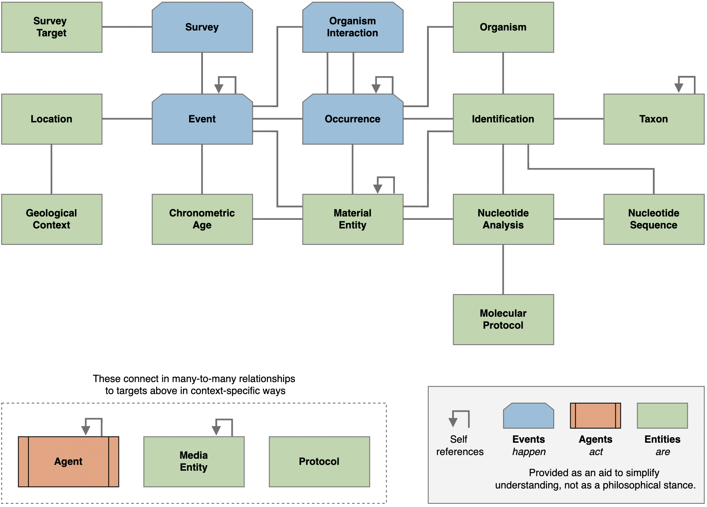
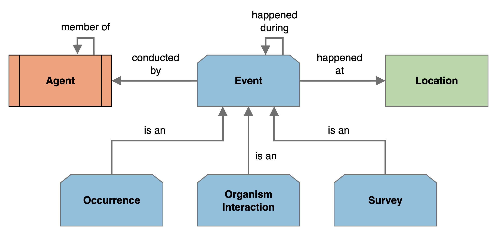
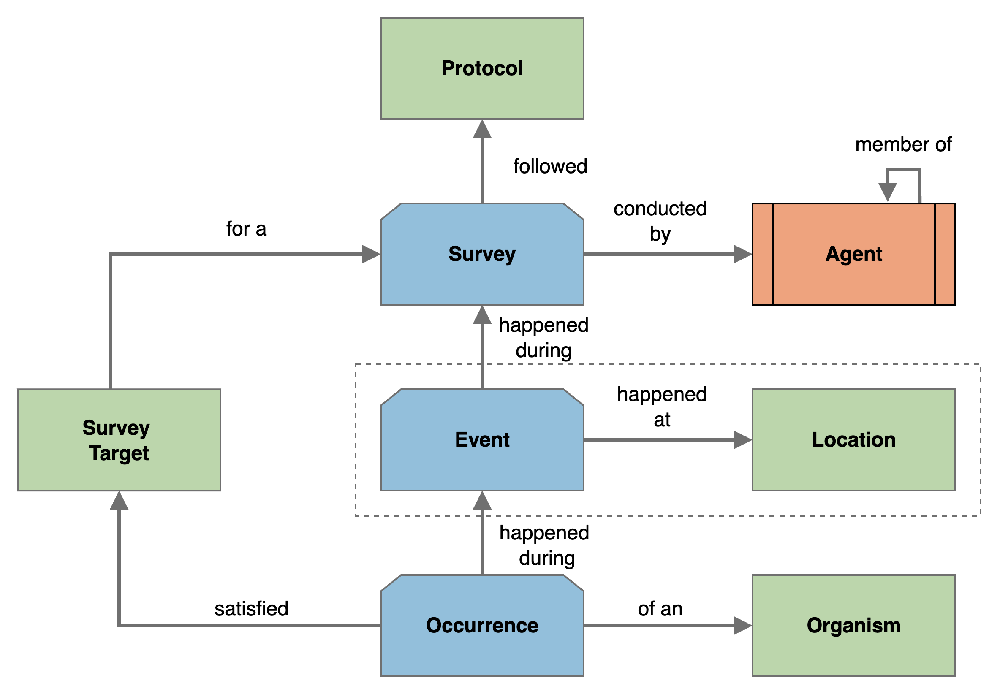
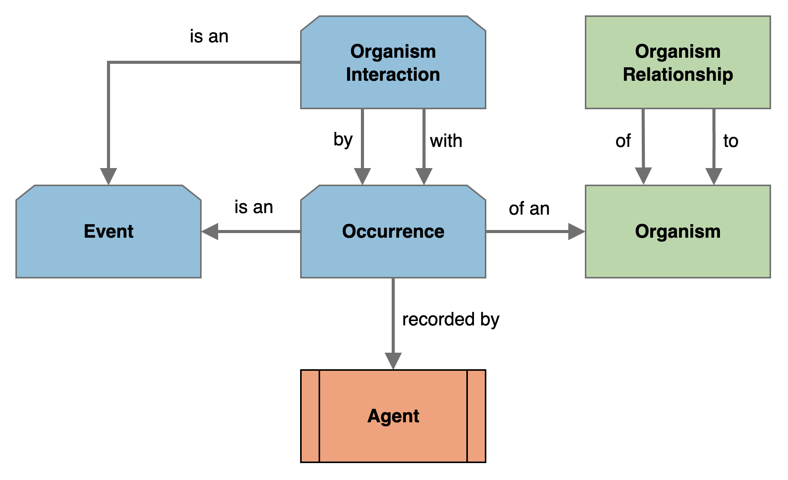
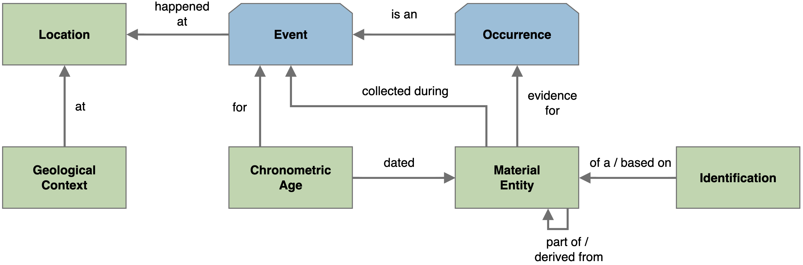
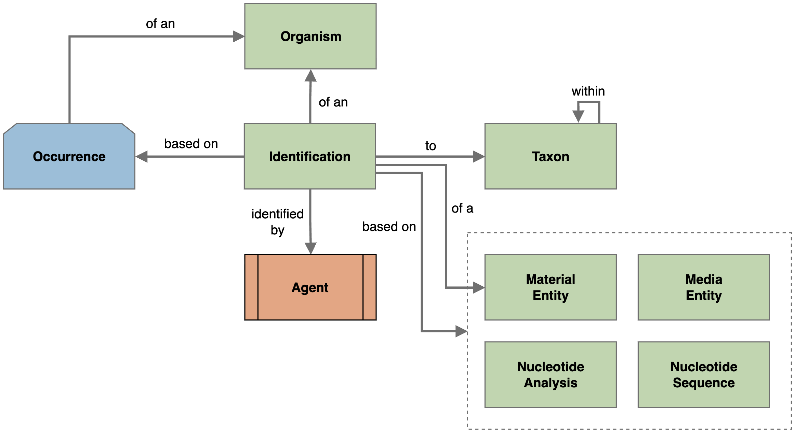
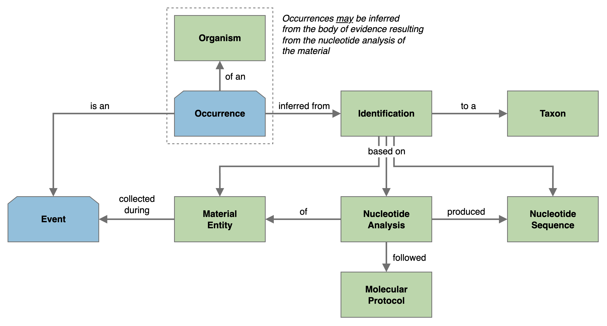
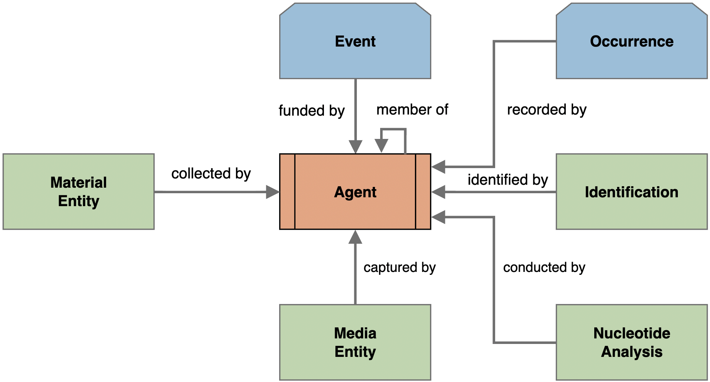
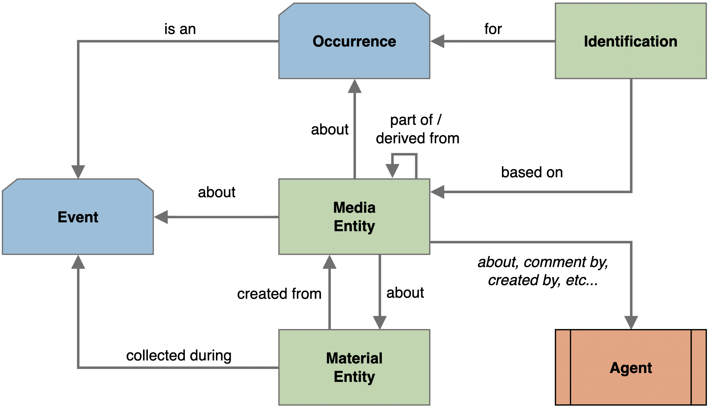

# Darwin Core conceptual model

Title
: Darwin Core conceptual model

Date version issued
: 2026-05-26

Date created
: 2026-05-26

Part of TDWG Standard
: <http://www.tdwg.org/standards/450>

This version
: <http://rs.tdwg.org/dwc/terms/cm/2026-05-26>

Latest version
: <http://rs.tdwg.org/dwc/terms/cm/>

Abstract
: Guidelines for the semantics of relationships between Darwin Core classes.

Contributors
: [John Wieczorek](https://orcid.org/0000-0003-1144-0290) ([Rauthiflor LLC, Global Biodiversity Information Facility](http://www.wikidata.org/entity/Q1531570)), [Tim Robertson](https://orcid.org/0000-0001-6215-3617) ([Global Biodiversity Information Facility](http://www.wikidata.org/entity/Q1531570)), [Paula Zermoglio](https://orcid.org/0000-0002-6056-5084) ([Instituto de Investigaciones en Recursos Naturales, Agroecología y Desarrollo Rural (IRNAD, CONICET - Universidad Nacional de Río Negro)](https://www.wikidata.org/wiki/Q6978293)), [Cecilie Svenningsen](https://orcid.org/0000-0002-9216-2917) ([Global Biodiversity Information Facility](http://www.wikidata.org/entity/Q1531570)), [Kate Ingenloff](https://orcid.org/0000-0001-5942-9053) ([Global Biodiversity Information Facility](http://www.wikidata.org/entity/Q1531570)), [Markus Döring](https://orcid.org/0000-0001-7757-1889) ([Global Biodiversity Information Facility](http://www.wikidata.org/entity/Q1531570)), [Peter Desmet](https://orcid.org/0000-0002-8442-8025) ([Instituut voor Natuur- en Bosonderzoek (INBO)](http://www.wikidata.org/entity/Q7315097)), [Tobias Guldberg Frøslev](https://orcid.org/0000-0002-3530-013X) ([Global Biodiversity Information Facility](http://www.wikidata.org/entity/Q1531570))

Creator
: Darwin Core Maintenance Group

Bibliographic citation
: Darwin Core Maintenance Group. 2026. Darwin Core conceptual model. Biodiversity Information Standards (TDWG). <http://rs.tdwg.org/dwc/terms/cm/2026-05-26>

## 1 Introduction

### 1.1 Purpose (non-normative)

The **Darwin Core Conceptual Model (DwC-CM)** provides a high‑level framework that shows how [Darwin Core](https://dwc.tdwg.org) (DwC) classes relate to one another in typical biodiversity information workflows. Darwin Core formally defines a [set of terms](https://dwc.tdwg.org/list/) grouped by classes; DwC‑CM **clarifies the conceptual meaning of those classes and the relationships among them** so implementers can make consistent, interoperable design choices across different technologies. 

The DwC‑CM does not prescribe an ontology of formal predicates for the relationships between classes. Instead, it uses natural‑language labels to convey semantic intent. 

The DwC-CM does not prescribe the implementation of systems based on Darwin Core using any particular technology. The model is not a strict blueprint for system design; instead, it is a **reference framework that can be applied in whole or in part**. An implementation can include entities and relationships that are not in the Conceptual Model. This includes using a less strict cardinality than is suggested by a predicate in this document, if warranted. Different system architectures may realize the model in different ways—for example:

* A relational database or tabular data publishing schema may represent relationships through joins across normalized tables.  
* A document-oriented approach may choose to embed related classes as nested objects within a record rather than by linking separate records.  
* A graph database may represent relationships as explicit links between nodes.

The DwC-CM is a synthesis of discussion within the Biodiversity Information Standards (TDWG) community. It accommodates the observed use of DwC to date and accommodates the results of a wide variety of targeted case studies to broaden the scope of Darwin Core. It does not attempt to anticipate every possible use, and it is expected to evolve as the demand for new uses arises.

By clarifying the conceptual relationships between Darwin Core classes, the DwC-CM helps implementers understand which connections are essential and the minimum cardinalities involved so that implementations are fundamentally consistent and correctly adapted in specific technical environments.

### 1.2 Audience (non-normative)

This guide is intended for developers, data architects, and system designers who are building applications, databases, or services that rely on Darwin Core. It highlights how the conceptual model can be used as a reference when making design decisions, ensuring both consistency when using the Darwin Core standard and flexibility in implementation. 

This guide is will also play an important role for scientists (in particular scientists dealing with data intensive workflows) to better understand what entities like Occurrence, Event, and Location mean, how they are related, and how they are supposed to be used. This matters, for example, when designing analyses, merging datasets, or interpreting integrated data.

### 1.3 Associated Documents (non-normative)

The following resources are closely related and are recommended reading:

* [Darwin Core Quick Reference Guide](https://dwc.tdwg.org/terms/) (abridged presentation of currently recommended Darwin Core term versions)  
* [Darwin Core List of Terms](https://dwc.tdwg.org/list/) (complete normative definitions of all Darwin Core term versions)  
* [Darwin Core Data Package Guide](https://gbif.github.io/dwc-dp/dp/) (specification for creating Darwin Core data packages)  
* [Darwin Core Data Package Quick Reference Guide](https://gbif.github.io/dwc-dp/qrg/) (contextual term definitions for tables and fields for a Darwin Core Data Package implementation of DwC-CM)  
* [Darwin Core Data Package Designer](https://gbif.github.io/dwc-dp/designer/) (tool to find terms, explore and visualize relationships, and build Darwin Core Data Package descriptors)

### 1.4 Status of the content of this document (normative)

Sections may be either normative (defines what is required to comply with the standard) or non-normative (supports understanding but is not binding) and are marked as such.

All sections of this document except this one are non-normative.

### 1.5 Notes on diagrams (non-normative)

Diagrams in this document are class diagrams. The boxes represent Darwin Core classes and the lines connecting the boxes represent established relationships between classes. Boxes do not represent instances of those classes (e.g., a specific *Event* as opposed to *Events* in general). For example, in Figure 1, the *Organism Interaction* class has two relationships to the *Occurrence* class. This does not mean that both relationships necessarily apply to the same *Occurrence* (instance). Indeed, most *Organism Interactions* involve two distinct *Occurrence* instances (two specific *Organisms* interacting in the same *Event*).

In Figures 2-9, the relationships between classes are labeled with predicates that describe that relationship succinctly using explanatory natural language. This document does not prescribe specific predicates from controlled vocabularies or ontologies.

Throughout the text, when a class is referred to in the plural, this is done by including the plural form of the class label within the formatting. Thus, *Material Entities* refers to multiple instances of the class labeled *Material Entity*, not to a single instance of a class labeled *Material Entities*.

## 2 Overview (non-normative)

The Darwin Core Conceptual Model is meant to facilitate understanding of established relationships between Darwin Core classes. This document relies on diagrams of these relationships with accompanying descriptions. 

Throughout the diagrams in this document, classes are referred to with the labels recommended by Darwin Core in bold (e.g., **Material Entity** for the class [http://rs.tdwg.org/dwc/terms/Material Entity](http://rs.tdwg.org/dwc/terms/Material Entity)). In the narrative, classes are referred to by their names in italics, (e.g., *Material Entity*). Thus, for example, when *Organism* is used, it is meant precisely in the sense of [http://rs.tdwg.org/dwc/terms/Organism](http://rs.tdwg.org/dwc/terms/Organism).

Figure 1 provides an overview of the DwC-CM. To avoid clutter, the nature of the relationships (directionality, cardinality and predicates) are omitted. This diagram also omits the vast number of possible relationships between the classes *Agent*, *Media Entity*, and *Protocol* to all of the other classes in the model. Relationships are described in detail in the thematic sections that follow the Overview. 



**Figure 1.** An overview of the Darwin Core Conceptual Model. Boxes represent classes and lines represent relationships between classes.

### 2.1 Event and Event hierarchies (non-normative)

In Darwin Core, an *Event* is an action, a process, or a set of circumstances occurring at some place during some interval of time. Figure 2 illustrates the basic types of *Events* in the DwC-CM. 



**Figure 2.** Details of the fundamental relationships of *Events*, of which there are four basic types – *Occurrences*, *Organism Interactions*, *Surveys*, and generic *Events*. Material gathering is considered here as a generic *Event*.

#### Description

* An *Event* is expected to include properties that document its nature (e.g., material gathering, observation, device deployment, expedition, etc.) and that document the time interval it spanned.

* Special types of *Events* (*Occurrences*, *Organism Interactions*, and *Surveys*) have distinct special characteristics in addition to those that cover their *Event* nature. 

* *Events* must happen at some *Location*, even if that *Location* is not known or not shared. Many distinct *Events* can happen at the same *Location*.

* *Events* may be conducted by *Agents* (e.g., people, organizations, groups, devices, software, etc.). Many distinct *Events* can be conducted by the same *Agent*. *Agents* may have many other distinct roles (e.g., funded, observed, archived, etc.) in relation to *Events* that are not explicitly defined here (i.e., not shown in Figure 2).

* *Events* can be nested in hierarchies. An *Event* hierarchy is structured on the premise that one *Event* (a child) is contained entirely within another *Event* (its parent), both spatially and temporally, and with some dependent connection. An *Event* can be the parent for many distinct *Events*, but it can have only one parent *Event*. An example of an *Event* hierarchy is a project (an *Event*) in which several camera trap deployments (*Events*) were made, each of which resulted in series of *Media Entity* captures (*Events*), some of which provided evidence for one or more *Occurrences* (*Events*).

#### Simplifications

Figure 2 represents a small subset of the DwC-CM, focusing only on the fundamental aspects of *Events*. *Events* can be related to many other classes in the DwC-CM. Those relationships are covered in further thematic sections below. 

Connections to *Event* from *Occurrence*, *Organism Interaction*, and *Survey* must not be interpreted to mean that a single *Event* can be a combination of those three classes. It only means that those three classes have *Event* properties in addition to their own distinct properties. 

#### Implementation notes

In theory, each distinct action, process, or set of circumstances occurring at some place during some interval of time is a distinct *Event*. In practice, it may be beneficial to allow a single *Event* to provide the spatio-temporal context for multiple activities simultaneously. For example, an *Organism Interaction* most often happens at the same place and time as each *Occurrence* it is related to. The *Organisms* involved in the interaction may also have been gathered at the same time. For all of these activities, the spatio-temporal information is the same. Rather than require the creation of five *Event* instances for the same place and time, a single *Event* could be created and referred to by the *Organism Interaction*, by both *Occurrences*, and by both the *Material Entities* that were gathered. Care must be taken in this implementation choice to allow the option to designate an *Event* as multi-faceted (e.g., dwc:eventCategory `context`).

Depending on the intended use of *Event* data, it may simplify data sharing models to subsume *Location* information within *Events*.

### 2.2 Survey (non-normative)

In Darwin Core, a *Survey* refers to an *Event* that is a biotic survey or inventory, which, with sufficiently detailed information, can support not only evidence of presence of *Organisms* but also absences of detection and estimations of abundance. Figure 3 illustrates the part of the DwC-CM most closely related to *Surveys*. 



**Figure 3.** Details of the fundamental relationships associated with *Surveys*.

#### Description

* Since a *Survey* is a type of *Event*, it happens at a *Location*, can be conducted by an *Agent*, and can participate in an *Event* hierarchy, all as described in the *Event* section. The *Event* hierarchy relationships in the diagram are labeled with "happened during".

* Complex structured *Surveys* can be expressed through an *Event* hierarchy. For example, a regional monitoring program (*Survey*) could consist of multiple repeated *Surveys* with the same or distinct *Protocols* conducted by different groups of people (*Agents*) with distinct devices (*Agents*) at specific sites (*Locations*).

* Being a special type of *Event*, a *Survey* has special characteristics in addition to those due to its *Event* nature. Many of these characteristics are defined in the [list of terms](https://eco.tdwg.org/list/) for the Humboldt Extension to Darwin Core.

* One important aspect of *Surveys* is that they often adhere to documented *Protocols*, where a *Protocol* is a method used during an action. A *Survey* may follow many different kinds of *Protocols*, including protocols for sampling and sampling effort (time spent, area covered, distance travelled, participants involved, etc).

* In conjunction with *Protocols*, a *Survey* can be limited to specific *Survey Targets*. A *Survey Target* is intended to declare what was being sought, either through *a priori* intention or through *post facto* filtering.

* The results of a *Survey* are expressed in the *Occurrences* it reports. Those *Occurrences* may be incidental ("bycatch") or they might match the criteria in a *Survey Target*.

* *Survey Targets* can be defined based on any combination of taxa, environmental conditions, organismal traits, etc. With sufficient supporting information, such as *Occurrences* accompanied by organism quantities, and whether reporting for the target was complete, a *Survey* has the potential to support inference of absence of detection, estimations of abundance, and statistical analyses of change over time.

#### Simplifications

Figure 3 is a small subset of the DwC-CM focusing on S*urveys*. Additional relationships such as *Media Entities* recorded, *Material Entities* gathered, and *Identifications* of *Organisms*, among others, are omitted here. Those relationships are covered in further thematic sections below.

### 2.3 Occurrence, Organism, and OrganismInteraction (non-normative)

In Darwin Core, the *Occurrence* class has had a long history of evolving meaning. It originated from the need to capture information about organisms in nature along with the evidence gathered (observations and specimens) to support the use of that information. The original definition of the term, "The category of information pertaining to evidence of an occurrence in nature, in a collection, or in a dataset (specimen, observation, etc.)", betrayed its semantic ambiguity. With the addition of *Material Sample* in 2013 and *Organism* in 2014, the semantics of Darwin Core became more clearly defined. In 2023, the introduction of *Material Entity* gave *Occurrence* its modern definition: "A dwc:Event that establishes the state of a dwc:Organism at a particular place and time." The "state" of a dwc:Organism covered by the dwc:Occurrence class consists of attributes of a dwc:Organism that can differ between dwc:Occurrences, such as dwc:lifeStage, dwc:sex, dwc:reproductiveCondition, dwc:behavior, weight, color, etc.

An *Organism* is defined in Darwin Core as "A particular organism or defined group of organisms considered to be taxonomically homogeneous." *Organisms* manifest both permanent and ephemeral characteristics. For example, the date a mammal was born, and the identity of its mother will never change, though its life stage and reproductive condition can. An *Occurrence* can capture the ephemeral state of a particular *Organism* at a place and time or posit that there was some *Organism* there and then based on indirect evidence.

Figure 4 illustrates how the DwC-CM relates *Occurrence*, *Organism*, and *Organism Interaction*.



**Figure 4.** Details of the fundamental relationships relating *Occurrence* and *Organism*.

#### Description

* Since an *Occurrence* is a type of *Event*, it happens at a *Location*, can be conducted by an *Agent*, and can participate in an *Event* hierarchy, all as described in the *Event* section.

* Being a special type of *Event*, an *Occurrence* has special characteristics in addition to those due to its *Event* nature. Specifically, an *Occurrence* represents an *Event* in which there was one of 1) a direct observation of an *Organism*, 2) or indirect inference that *Organism* existed, or 3) the absence of detection of any *Organism* of a given *Taxon* in a particular state (e.g., exhibiting a behavior, having a particular trait, etc.) during the given time interval at the given *Location*, potentially recorded by an *Agent*.

* An *Organism* can be present in many *Occurrences*, each time with potentially different characteristics.

* The permanent characteristics of the *Organism* are properties of that class.

* The permanent relationships (e.g., mother of, sibling of, etc.) of *Organisms* to other *Organisms* are represented by the *Organism Relationship* class.

* Non-permanent relationships between *Organisms* can be represented by *Organism Interactions*. Note that these interactions are explicitly at the *Organism* level, not at the *Taxon* level. Thus, you would expect observed interaction types such as "visited" rather than habitual interactions types such as "visits". Similarly, you should not capture an interaction type such as "parasitoid of" unless that behavior was observed for that particular *Organism*, in which case a better relationship phrase might be "parasitized".

* Figure 4 shows two relationships between *Organism Interaction* and *Occurrence*. One of these is to represent the actor or subject side of the interaction while the other is to represent the target or object side of the interaction. In practice, this would usually involve creating two *Occurrence* records (instances) — one for each *Organism*. In the special case of an *Organism* engaged in a self-directed behavior, only one *Occurrence* record is needed, which can be pointed to by both the `by` and `with` relationships.

* The two *Occurrences* participating in an *Organism Interaction* are different things that happened at the same place and time (e.g., the behaviors of the two participating *Organism* could easily be different). The *Organism Interaction* is yet something else that happened at that same *Location* and time. Though all three of these *Events* may (but do not necessarily) share the same spatio-temporal context, the activities were distinct. For example, a hummingbird was flying (a behavior characterizing one *Occurrence*) as it "drank nectar from" (the interaction with) a flower (the other *Occurrence*). The *Organism Interaction* did not fly, the hummingbird did. The interaction is its own *Event* with its potentially own characteristics apart from those of the *Occurrences*. 

#### Implementation notes

The implementation notes in the *Event* section also apply to *Occurrences* and *Organism Interactions*, namely, that in practice it may be beneficial to allow a single *Event* to provide the spatio-temporal context for multiple activities (two *Occurrences* and their corresponding *Organism Interaction*).

Depending on the intended use of *Occurrence* and *Organism* data, it may simplify data sharing models to subsume *Organism* information within *Occurrences*.

### 2.4 Material Entity, Chronometric Age and GeologicalContext (non-normative)

In Darwin Core, a *Material Entity* is defined as "An entity that can be identified, exists for some period of time, and consists in whole or in part of physical matter while it exists." The DwC-CM provides a framework for representing the relationships between *Material Entities* and other classes that provide the contexts in which they are found and used, as shown in Figure 5.



**Figure 5.** Details of the fundamental relationships of specimens and material samples expressed as *Material Entities*.

#### Description

* A *Material Entity* represents physical matter that may be gathered (in whole) or sampled (in part) during an *Event* at a specific *Location* and time.

* A *Material Entity* may consist of, for example, an entire *Organism*, a part of the *Organism* (e.g., a leaf), a member of an *Organism* that is a group (e.g., a fish in a jar), non-biological material (e.g., a rock, an ice core), some environmental material (e.g., soil), or a DNA extract.

* A *Material Entity* may be the subject of interest while being part of, yet not separate from, a containing *Material Entity*. For example, a fossil in a rock.

* A *Material Entity* may be processed in some way that removes a part of the original material, resulting in new *Material Entities*. For example, a skeleton removed from the full body of an *Organism*. This can be expressed using the “derived from” relationship from the extracted *Material Entity* to the source *Material Entity*. When a *Material Entity* is derived from another *Material Entity*, the two parts become distinct from each other and distinct from the original *Material Entity*. The DwC-CM does not take a stance on the generation of new *Material Entity* instances other than that the derived and derived-from *Material Entities* must both have instances.

* An *Identification* may be based on evidence in the form of a *Material Entity*. The gathering context (*Event*) of that *Material Entity* may in turn provide evidence of an *Occurrence*.

* The context during the gathering *Event* for a *Material Entity* may provide evidence of a remote (in time or place) *Occurrence*. The *Occurrence* might be derived from a *GeologicalContext* at the gathering *Location*, or from a *Chronometric Age* determination (e.g., radiocarbon dating) based either on the *Material Entity* itself or based on a datable associated *Material Entity* or context.

#### Simplifications

In DwC-CM, the Darwin Core *Material Sample* class is omitted in favor of *Material Entity* because the narrower scope of *Material Sample* is of little practical use. A *Material Sample* is simply a *Material Entity* that was derived from another *Material Entity* whether explicitly or not.

### 2.5 Identification (non-normative)

In Darwin Core, an *Identification* is defined as "A classification of a resource according to a classification scheme." For Organisms, this means, "A taxonomic determination (i.e., the assignment of a dwc:Taxon to a dwc:Organism)". Figure 6 illustrates how DwC-CM relates *Identification* to other classes.



**Figure 6.** Details of the fundamental relationships between *Identification* and other classes.

#### Description

* An *Identification* expresses an opinion by an *Agent* (human or otherwise) that an *Organism* or other *Material Entity* (whether observed or inferred) was a member of a class within a classification scheme. *Organism* example: an *Identification* registers an opinion that an *Organism* is a member of the set of all *Organisms* that make up a *Taxon*, ideally based on verifiable evidence. Non-*Organism* *Material Entity* example: an *Identification* registers an opinion that a mineral (*Material Entity*) has the characteristics that qualify it to be given a specific mineral name according to a classification scheme.

* A *Taxon* can occupy a rank in a hierarchical classification system.

* There can be multiple *Identifications* for a single *Organism* or other *Material Entity*, including historical ones, accepted ones, and differing opinions, each according to an *Agent*.

* An *Agent* can make an *Identification* based on an observation of an *Occurrence* of an *Organism* without verifiable evidence.

* An *Agent* can be responsible for making many *Identifications*.

* In addition to *Identifications* based solely on observations, there can be *Identifications* based on several other kinds of evidence:   
  * the inspection or processing of a *Media Entity* of an *Occurrence* by an *Agent*,   
  * the inspection or processing of a *Material Entity* by an *Agent*,   
  * the inspection or processing of a *Media Entity* of a *Material Entity* by an *Agent*, or
  * a *Nucleotide Analysis* that detects a *Nucleotide Sequence* or confirms the presence of evidence of an *Organism* representing a *Taxon*. This may subsequently be used to infer an *Occurrence* (see the *NucleotideAnalysis, NucleotideSequence and MolecularProtocol* section).

#### Simplifications

Figure 6 shows a single arrow from *Identification* to the group of distinct classes that it might be based on. The arrow signifies that each of those targets is possible, not that they all must contribute to a given *Identification*. Indeed, a given *Identification* must be based on only one of those classes, though multiple *Identifications* based on distinct classes might yield the same *Taxon* determination.

#### Implementation notes

Depending on the intended context of *Identification* and *Taxon* data, it may simplify data sharing models to subsume *Taxon* information within *Identifications*.

### 2.6 NucleotideAnalysis, NucleotideSequence and MolecularProtocol (non-normative)

The DwC-CM provides a framework for representing *Nucleotide Analyses*, accommodating:

1. Metabarcoding and metagenomic techniques for detecting taxa in sampled *Material Entities*.  
2. Targeted DNA-based assays (e.g., qPCR) to confirm the presence or absence of specific target *Taxa*.  
3. Integration of sequence-based (barcoding) and non-sequence-based *Identifications* derived from the same *Material Entity*.

These cases are represented within the model as depicted in Figure 7.



**Figure 7.** Details of the fundamental relationships associated with *Nucleotide Analyses*.

#### Description

* A *Nucleotide Analysis* of a *Material Entity* follows a *Molecular Protocol* that records the procedures used (e.g., primers, target regions).  

* The *Material Entity* is linked to the originating *Event*, documenting when, where, and by whom it was gathered, along with any additional context.  

* A *Nucleotide Analysis* may produce one or more *Nucleotide Sequences*, or may only confirm the presence or absence of the *Molecular Protocol* target.  

* The *Material Entity*, *Nucleotide Analysis*, and *Nucleotide Sequence* provide evidence for one or more *Identifications* based on:  
  * the *Material Entity* alone (e.g., a human *Agent* identifying an *Organism*),  
  * a *Nucleotide Analysis* detecting or confirming the presence of one or more target *Taxa*, or  
  * comparisons of detected *Nucleotide Sequences* against a reference catalogue (potentially yielding many *Identifications*).  
      
* The resulting body of evidence may be used to infer the *Occurrence* of an *Organism* in the sampled *Material Entity* — whether a taxon-specific detection (e.g., qPCR) or from sequenced genomic reads or barcode genes that are identified from matching with a DNA reference database (e.g., barcoding, metabarcoding, and metagenomics).

#### Simplifications

*Agents* (e.g., people) responsible for activities are omitted here, but can be associated with the relevant classes (see the *Agent* section).

A *Material Entity* may be either a defined `part of` or `derived from` another *Material Entity*, such as a tissue extract (see the *Material Entity* section).

An *Event* representing the gathering of the *Material Entity* may belong to a larger *Survey* or to a hierarchy of nested *Events* (see the *Event* and *Survey* sections).

#### Implementation notes

Inferred *Occurrences* should be subject to data quality control or confidence measures, since several factors may affect detection results. The DwC-CM does not prescribe how such measures should be implemented.

In some cases, the analyzed *Material Entity* is not preserved or documented. If so, implementers may link the *Nucleotide Analysis* directly to the relevant sampling *Event* to provide the spatio-temporal context and allow *Occurrence* inferences to be made.

### 2.7 Agents (non-normative)

In Darwin Core, an *Agent* is defined as "A resource that acts or has the power to act" with the following usage comment:

```
A person, group, organization, machine, software or other entity that can act. Membership in the dcterms:Agent class is determined by the capacity to act, even if not doing so in a specific context. To act: To participate in an event or process by contributing through behavior, operation, or an effect resulting from active participation — regardless of whether that contribution is intentional, volitional, or conscious.
```

*Agents* have the capacity to act in relation to any other class as well as to be related to each other. Figure 8 shows a few examples that illustrate the ways in which *Agents* can be related to other classes in the DwC-CM. 



**Figure 8.** Details of the ways in which *Agents* can be related to other classes. The labels on the relationships all represent well-established *Agent* relationships, but constitute only a few of the many relationships one might want to establish.

#### Description

* An *Agent* is distinguished by its capacity to act, but is not otherwise limited in its nature.

* An *Agent* may be related to another *Agent*. For example, a person (an *Agent*) might belong to a crew (an *Agent* that is a group of people), deploy a camera trap (an *Agent* that is a device), or be associated with an institution (an *Agent*) that owns the device.

* In addition to relationships between *Agents*, the DwC-CM supports any relationship that involves an *Agent* acting in or otherwise fulfilling a role with respect to an instance of another class. For example, a *Material Entity* can be identified by an *Agent*. This relationship might be enabled by a dedicated "identifiedByID" property for the *Material Entity*. This is a convenient way to capture well-established *Agent* roles. 

#### Simplifications

There are myriad ways in which an *Agent* might be related to other classes. This section shows only a few examples without prescribing the details of how those relationships should be implemented.

#### Implementation notes

In practice, classes may be directly related to *Agents* through dedicated properties that expect to be populated with an *Agent* identifier. Examples from Darwin Core of this way of connecting classes with *Agents* include terms such as identifiedByID and recordedByID along with many others from the dwciri: namespace. 

In addition to direct relationships through properties of classes as described in the previous paragraph, any relationship involving an *Agent* for which there is no dedicated property on the target class could be constructed through the implementation of an *Agent Role*, which would join an instance of *Agent* to an instance of another class and declare the relationship type. 

### 2.8 Media (non-normative)

In Darwin Core, *Media Entities* are things that are recorded (e.g, instances of the Dublin Core type vocabulary terms *Still Image*, *Moving Image*, *Sound*, and *Text*). The DwC-CM provides a framework for representing the relationships of *Media Entities* to other classes as shown in Figure 9.



**Figure 9.** Details of the fundamental relationships associated with *Media Entity*.

#### Description

* A *Media Entity* can be about a wide variety of subject matter, including *Agents*, *Events*, *Material Entities,* and *Occurrences*.

* One *Media Entity* instance can have many subjects and each subject can be in many *Media Entity* instances.

* A *Media Entity* can be used as the basis for making an *Identification* of an *Organism* either via an *Occurrence* (e.g., a sound recording of a bird) or via a *Material Entity* (e.g., an image of a specimen).

* A *Material Entity* might be created from *Media Entity* (e.g., 3D printed model of a skull from a 3D digital model).

* In some cases, relationships need to be made to specific "regions of interest" within a *Media Entity* (e.g., a segment of a video or sound track or a region within an image). A region of interest can be treated as a *Media Entity* instance that is part of its parent *Media Entity* instance. 

#### Simplifications

This section does not illustrate all anticipated uses of *Media Entities*. For example, relationships of *Media Entity* to *Chronometric Age*, *Geological Context*, and *Organism Interaction* are not shown.

## 3 Example implementations (non-normative)

* The Darwin Core Data Package Guide specifies how to create Frictionless Data packages using Darwin Core terms. A Darwin Core Data Package (DwC-DP) consists of schemas for describing tabular data, such as CSV files. DwC-DP is considered a reference implementation of the DwC-CM.  
* The openDS format provides a JSON Schema for modelling extended information about digital specimens and implements the relevant parts of the DwC-CM.

## 4 Acknowledgements (non-normative)

The DwC-CM is a synthesis of years of discussion and contributions to Biodiversity Information Standards (TDWG) Interest Groups. The synthesis arose during research towards "Diversifying the GBIF Data Model” within the Global Biodiversity Information Facility work program, which brought additional perspectives from the GBIF community and included a series of iterative approaches to refine and validate both a conceptual model and a data publishing model through a wide variety of biodiversity data use cases. Data structures of many operational systems, including all commonly used open source collection management systems, have been studied and have influenced this model. 
