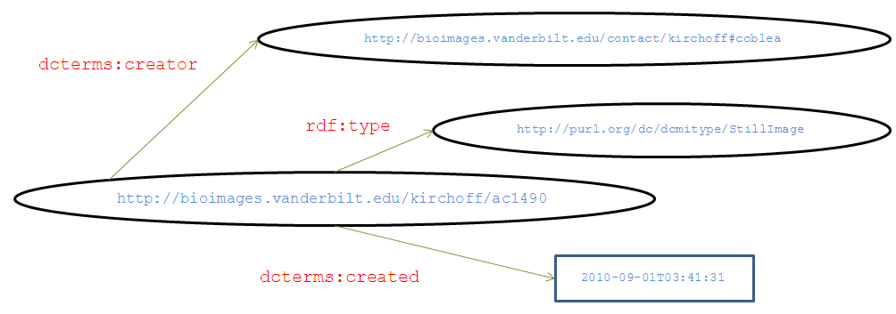

 Darwin Core RDF Guide                        

# Darwin Core RDF Guide

Title
: Darwin Core RDF Guide

Date Issued
: 2015\-03\-27

Date Modified
: 2016\-04\-25

Abstract
: This guide is intended to facilitate the use of Darwin Core terms in the Resource Description Framework (RDF). It explains basic features of RDF and provides details of how to expose data in the form of RDF using Darwin Core terms and terms from other key vocabularies. It defines terms in the namespace http://rs.tdwg.org/dwc/iri/ which are intended for use excusively with non\-literal objects.

Contributors
: Steve Baskauf (TDWG RDF/OWL Task Group), John Wieczorek (TDWG Darwin Core Task Group), John Deck (Genomic Biodiversity Working Group), Campbell Webb (TDWG RDF/OWL Task Group), Paul J. Morris (Harvard University Herbaria/Museum of Comparative Zoölogy), Mark Schildhauer (National Center for Ecological Analysis and Synthesis) (KUNHM)

Legal
: This document is governed by the standard legal, copyright, licensing provisions and disclaimers issued by the Taxonomic Databases Working Group.

Part of TDWG Standard
: [http://www.tdwg.org/standards/450/](http://www.tdwg.org/standards/450/)

Creator
: Darwin Core and RDF/OWL Task Groups

Identifier
: http://rs.tdwg.org/dwc/2015\-06\-02/terms/guides/rdf/

Latest Version
: [http://rs.tdwg.org/dwc/terms/guides/rdf/](http://rs.tdwg.org/dwc/terms/guides/rdf/index.htm)

Replaces
: http://rs.tdwg.org/dwc/2015\-03\-27/terms/guides/rdf/

Document Status
: Current Standard

# 1 Introduction[](./index.htm#1_Introduction)

Each method of encoding information using Darwin Core \[[DWC](http://rs.tdwg.org/dwc/index.htm)\] has a guide explaining how to use the Darwin Core terms in that situation. This is the guide for encoding biodiversity data using the Resource Description Framework \[[RDF](http://www.w3.org/TR/rdf11-concepts/)\].

## 1.1 Audience[](./index.htm#1.1_Audience)

The Darwin Core RDF Guide is targeted toward those who wish to share biodiversity data described by Darwin Core (DwC) properties using RDF. It describes how community best practices for expressing fundamental information about resources using RDF relate to Darwin Core terms, and clarifies how Darwin Core terms should be used in RDF with literal (string) and non\-literal (IRI reference) objects. It is not intended to explain the model and syntax of RDF. For a general introduction to RDF in a biodiversity context, see the \[[RDF\-BEGINNERS\-GUIDE](http://code.google.com/p/tdwg-rdf/wiki/Beginners)\]. For a more detailed introduction to RDF, see the \[[RDF\-PRIMER](http://www.w3.org/TR/rdf11-primer/)\].

## 1.2 Rationale[](./index.htm#1.2_Rationale)

Darwin Core is a vocabulary which provides terms that can be used to describe the properties and types of entities (known in RDF as "resources") in the biodiversity realm. Darwin Core is a general purpose vocabulary because its terms can be used as part of a number of data transfer systems. RDF differs in several important ways from other data transfer systems for which DwC usage guides exist (\[[TEXTGUIDE](http://rs.tdwg.org/dwc/terms/guides/text/)\] and \[[XMLGUIDE](http://rs.tdwg.org/dwc/terms/guides/xml/)\]). By its nature, RDF is a distributed system. It is assumed that data from one provider will be linked to data from other providers. This also implies that it is always possible to discover new data properties about a particular resource and that those properties may be described using unfamiliar terms. This differs significantly from other data transfer systems where there must be a pre\-existing agreement (in the form of a federation schema or human\-understandable document) between the sender and receiver about the format of the data and the organization and interpretation of the terms within records. Because RDF is intended to facilitate data and metadata discovery by machines (actually computer programs known as semantic clients or just "clients"), the meaning and use of terms must be well\-defined and discoverable by clients without human intervention. To facilitate cross\-referencing of resources among different data providers, resources must be identified using standardized, machine\-understandable, and globally unique identifiers known as internationalized resource identifiers (IRIs). Finally, because anyone can make statements about a resource without agreeing to a pre\-determined schema, RDF by its nature is a highly normalized network of relationships, in contrast to typical database tables which are by their nature "flat". Because of these differences, effective use of RDF requires that its users adhere to what are essentially evolving social conventions about identifiers, data transfer protocols, and application of vocabularies. Some of these conventions will be described in the following sections.

## 1.3 Features of RDF[](./index.htm#1.3_Features_of_RDF)

This section describes some of the basic features of RDF. It is not intended as a tutorial on RDF, but rather to provide enough information about the features of RDF to explain why specific guidelines for the use Darwin Core in RDF are necessary and why an additional Darwin Core namespace has been created.

### 1.3.1 Serialization and syntax[](./index.htm#1.3.1_Serialization_and_syntax)

The RDF model itself is independent of any specific serialization syntax. The following diagram represents a set of facts about an image in a graphical form easily understood by humans.



Each arrow represents a statement about the image, called a "triple" in RDF. The set of triples is called an RDF graph. Resources (represented by ovals) are identified by IRIs. The described resource (in this example the image http://bioimages.vanderbilt.edu/kirchoff/ac1490 at the tail of the arrow) is called the subject of the triple. Properties of the subject resource are identified by term IRIs shown here with their namespaces abbreviated (e.g., _dcterms:_ = "http://purl.org/dc/terms/"). The property is called the predicate of the triple. The values of the properties are called the object of the statement, with literal values (consisting of text) represented by rectangles.

This RDF graph can be serialized in a somewhat human\-friendly syntax called Terse RDF Triple Language (Turtle) \[[TURTLE](http://www.w3.org/TR/turtle/)\]:

```turtle
@prefix rdf:  <http://www.w3.org/1999/02/22\-rdf\-syntax\-ns#>.  
@prefix xsd:  <http://www.w3.org/2001/XMLSchema#>.  
@prefix dcterms:  <http://purl.org/dc/terms/>.  
<http://bioimages.vanderbilt.edu/kirchoff/ac1490>a <http://purl.org/dc/dcmitype/StillImage>;  
       dcterms:created "2010\-09\-01T03:41:31"^^xsd:dateTime;  
       dcterms:creator <http://bioimages.vanderbilt.edu/contact/kirchoff#coblea>.
```

Here is the graph in RDF/XML syntax \[[RDF\-XML\-SYNTAX](http://www.w3.org/TR/rdf-syntax-grammar/)\]:

```rdf
<?xml version\="1.0" encoding\="UTF\-8"?>  
<rdf:RDF  xmlns:rdf\="http://www.w3.org/1999/02/22\-rdf\-syntax\-ns#"  
xmlns:dcterms\="http://purl.org/dc/terms/"  
\>  
 <rdf:Description  rdf:about\="http://bioimages.vanderbilt.edu/kirchoff/ac1490"\>  
   <rdf:type  rdf:resource\="http://purl.org/dc/dcmitype/StillImage"/>  
   <dcterms:creator  rdf:resource\="http://bioimages.vanderbilt.edu/contact/kirchoff#coblea"/>  
   <dcterms:created  rdf:datatype\="http://www.w3.org/2001/XMLSchema#dateTime"\>2010\-09\-01T03:41:31</dcterms:created>  
 </rdf:Description>  
</rdf:RDF>
```

In this document, the following formatting conventions will be used. Full IRIs will be shown in Courier type and enclosed in angle brackets, e.g.,

<http://bioimages.vanderbilt.edu/contact/kirchoff#coblea>

Abbreviated UIRIs will be shown in _italics_ in the form _namespace:localName_, e.g., _rdf:type_. Namespace abbreviations when shown by themselves will also be shown in italics, e.g., _dwc:_ . Examples will be displayed in Courier type.

XML is a widely understood form of RDF serialization. Therefore, all examples given here will be shown as RDF/XML. In most cases, they will also be shown in Turtle. For more detailed information about RDF serialization, see part 3 of the Beginner's Guide to RDF \[[RDF\-BEGINNERS\-GUIDE](http://code.google.com/p/tdwg-rdf/wiki/Beginners)\] and the references cited there.

### 1.3.2 Internationalized Resource Identifier (IRI)[](./index.htm#1.3.2_Internationalized_Resource_Identifier_(IRI))

Data providers make use of a variety of identifiers to refer to resources they wish to provide. These identifiers may be locally unique within the provider's database, or they may be globally unique. Providers have sought to make their identifiers globally unique through such means as "Darwin Core Triplets" (institutionCode:collectionCode:catalogNumber) and creation of UUIDs \[[UUID](http://www.iso.org/iso/home/store/catalogue_ics/catalogue_detail_ics.htm?csnumber=62795)\]. However, only identifiers in the form of IRIs \[[IRI](http://tools.ietf.org/html/rfc3987)\] can be valid subjects of statements (known as RDF triples) in RDF, so neither “Darwin Core Triples” nor UUIDs can be used in unmodified form for that purpose. IRIs are a superset of a narrower form of identifiers known as Uniform Resource Identifiers (URIs) that can be used in place of IRIs \[[URI](http://tools.ietf.org/html/rfc3986)\]. This document will refer exclusively to IRIs with the understanding that URIs may be used in place of IRIs.

The most familiar form of IRI is a Uniform Resource Locator (URL) which not only identifies a resource, but provides information about retrieving an information resource (i.e., a resource that can be transmitted in electronic form) such as text in the form of an HTML web page. However, in general IRIs may identify non\-information resources (physical or conceptual entities) that are not transmittable electronically, e.g., <http://bioimages.vanderbilt.edu/contact/kirchoff#coblea>, a person. If a client attempts to retrieve a non\-information resource by dereferencing its HTTP IRI, a process called content negotiation \[[HTTP\-CONTENT\-NEGOTIATION](http://tools.ietf.org/html/rfc2616#section-12)\] is used to refer the client to the IRI of an information resource representation of the non\-information resource. For humans, this is usually a web page, while for semantic clients (machines) the representation is a document in the form of RDF/XML. For more detailed information about IRIs see part 1 of the Beginner's Guide to RDF \[[RDF\-BEGINNERS\-GUIDE](http://code.google.com/p/tdwg-rdf/wiki/Beginners)\] and the references cited there.

#### 1.3.2.1 Persistent Identifiers[](./index.htm#1.3.2.1_Persistent_Identifiers)

Best practices dictate that identifiers (known as persistent identifiers or globally unique identifiers: GUIDs) which are used to identify resources of permanent interest be globally unique, referentially consistent, and persistent \[[GUID\-STANDARD](http://www.tdwg.org/standards/150/)\]. If those identifiers are to be used to identify subject resources in RDF, they must also be in the form of an IRI. This has two implications for data providers.

First, if a non\-IRI globally unique identifier is used to identify a subject resource, it must be converted to an IRI by making it conform to a well\-known IRI scheme (e.g., a URN or HTTP IRI) \[[URI\-SCHEMES](http://www.iana.org/assignments/uri-schemes.html)\]. For example, a UUID can be transformed into a URN \[[UUID\-URN\-NAMESPACE](http://tools.ietf.org/html/rfc4122)\] by prefixing its string representation with "urn:uuid:" as in

<urn:uuid:f81d4fae\-7dec\-11d0\-a765\-00a0c91e6bf6>

Similarly, ISBNs can be converted to URNs \[[ISBN\-AS\-URN](http://tools.ietf.org/html/rfc3187)\] as shown in Examples 13 and 14. Although these URNs are valid IRIs, they have the disadvantage that they are not actionable (see [Section 1.3.2.2](./index.htm#1.3.2.2_HTTP_IRIs_as_self-resolving_GUIDs)). In contrast, the "Darwin Core triplet"

MVZ:Mamm:165861

has been turned into an actionable IRI by appending it to the base string "http://arctos.database.museum/guid/":

<http://arctos.database.museum/guid/MVZ:Mamm:165861\>

Second, if a provider refers to a resource using an URL that provides data about the resource, the provider should take care to ensure that the URL does not change over time (e.g., if the content moves to a different server, if the directory structure changes, or if a new version of the database is introduced). It may be preferable to use content negotiation \[[HTTP\-CONTENT\-NEGOTIATION](http://www.w3.org/TR/cooluris/)\] to redirect the user from a persistent IRI which refers to the resource, to the URL of a web page which describes the resource.

For a more detailed introduction to persistent identifiers, see the GBIF Beginner's Guide to Persistent Identifiers \[[GUID\-GUIDE\-GBIF](http://www.gbif.org/resources/2575)\].

Based on the precedent set by the TDWG LSID Applicability Statement standard \[[GUID\-STANDARD](http://www.tdwg.org/standards/150/)\], it is recommended that URN\-based IRIs be related to HTTP\-proxied equivalents (if they exist) as described in [Section 2.2.3](./index.htm#2.2.3_Associating_a_URN_with_its_HTTP-proxied_equivalent).

#### 1.3.2.2 HTTP IRIs as self\-resolving GUIDs[](./index.htm#1.3.2.2_HTTP_IRIs_as_self-resolving_GUIDs)

Advocates of principles of Linked Data \[[LINKED\-DATA](http://linkeddata.org/)\] prefer to use identifiers which follow the HTTP IRI scheme \[[HTTP](http://tools.ietf.org/html/rfc2616)\], known as "HTTP IRIs". In addition to being globally unique, such identifiers have the advantage of being dereferenceable using a widely implemented protocol . As such, it is possible to implement HTTP IRIs so that a human end user can obtain information about the resource using a conventional web browser. It is also possible to implement HTTP IRIs so that data (in the form of RDF) describing the resource can be discovered by a semantic client. In recognition of the advantages conferred by HTTP IRIs, the TDWG GUID Applicability Statement standard \[[GUID\-STANDARD](http://www.tdwg.org/standards/150/)\] specifies in Recommendation 2 that "HTTP GET resolution must be provided for non\-self\-resolving GUIDs". For this reason, providers of biodiversity information who intend to make data available through RDF should plan to implement GUIDs that are persistent HTTP IRIs. This is not to the exclusion of other forms of non\-self\-resolving globally unique identifiers that can be associated with the HTTP IRI using the methods described in [Section 2](./index.htm#2_Implementation_Guide) of this guide.

## 1.4 Use of terms in RDF[](./index.htm#1.4_Use_of_terms_in_RDF)

### 1.4.1 Well\-known vocabularies[](./index.htm#1.4.1_Well-known_vocabularies)

Because RDF assumes no pre\-existing agreement between data providers and consumers about the terms used as properties to describe resources, the likelihood that a consuming client will "understand" the meaning of an RDF triple will be increased if the provider uses terms from a well\-known vocabulary. Some well\-known general and biodiversity\-related vocabularies are listed in the Introduction to the Beginner's Guide to RDF \[[RDF\-BEGINNERS\-GUIDE](http://code.google.com/p/tdwg-rdf/wiki/Beginners#0.3.7._Biodiversity-related_and_General_vocabularies_and_ontolog)\]. If no well\-known term exists to represent a property needed to describe a resource, a data provider may "mint" its own term. In that case, the provider should assign the term an IRI, define the term in RDF, provide clear human\-understandable documentation of how the term should be used, provide for dereferencing of the IRI, and commit to the long\-term stability of the term IRI and definition.

### 1.4.2 Appropriate use of terms[](./index.htm#1.4.2_Appropriate_use_of_terms)

Because of the machine\-oriented nature of RDF, a provider must assume that a consuming client will not infer any meaning from a statement other than what is directly stated or what can be inferred logically from other statements made about the resources and terms involved in the statement. For example, a provider might use the name of a resource in a triple with the intention that the name represent the resource itself. However, if the term used as the predicate in the triple is designed to refer to resources themselves rather than names of resources, the client may fail to make the connection between the name and the resource itself. Depending on how the term is defined, the client may detect an inconsistency or draw unintended conclusions as described below. Inappropriate use of terms as RDF predicates can have unintended consequences because unlike text\-based data transfer protocols, RDF is designed to allow clients to infer additional facts based on information contained in the definitions of the terms. For example, the definition of the term _foaf:depicts_ \[[FOAF](http://xmlns.com/foaf/spec/)\] contains a statement declaring its domain to be _foaf:Image_ . Thus a provider which describes a resource using a _foaf:depicts_ property is also implicitly (and perhaps unknowingly) declaring the resource to be an image. Terms which are defined using a form of RDF known as Web Ontology Language (OWL) \[[OWL](http://www.w3.org/TR/owl2-overview/)\] may have restrictions placed on their use. For example, declaring a term to be an _owl:ObjectProperty_ indicates that it is inconsistent for the value of that property to be a string literal (i.e., the value should be an IRI).

For these reasons, terms should be used as predicates in RDF only after the data provider has carefully examined the documentation and usage guidelines associated with the vocabulary or ontology which defines the term and has determined that use of that term is consistent with the meaning which the provider intends to impart to the triple in which the term is to be used as a predicate.

For more detailed information about the implications of using terms that have range, domain, and subproperty declarations in RDF, see part 4 of the Beginner's Guide to RDF \[[RDF\-BEGINNERS\-GUIDE](http://code.google.com/p/tdwg-rdf/wiki/Beginners)\]. For more detailed information about how OWL is used to define complex properties of terms in RDF, see part 7 of the Beginner's Guide to RDF \[[RDF\-BEGINNERS\-GUIDE](http://code.google.com/p/tdwg-rdf/wiki/Beginners)\].

### 1.4.3 Use of Darwin Core terms in RDF[](./index.htm#1.4.3_Use_of_Darwin_Core_terms_in_RDF)

The general Darwin Core vocabulary, whose terms are in the _dwc:_ namespace (http://rs.tdwg.org/dwc/terms/), is designed primarily to facilitate the transfer of text\-based records from relatively "flat" database tables. Because of this, the term recommendations associated with the general vocabulary suggest using text strings to refer to physical and conceptual entities, i.e., names to represent people, citations to represent articles, codes to represent institutions, etc. (The several kinds of roles intended for text strings are detailed in [Section 1.5](./index.htm#1.5_Roles_of_text_strings_as_values_of_properties_in_dwc:_namesp).) When a record has multiple values for a property, the general Darwin Core term definitions recommend that the multiple strings be concatenated and delineated in a single field to avoid forcing the creation of a more normalized data structure.

However, in RDF, identification of physical and conceptual entities is generally accomplished by IRI references rather than literals. If there are multiple values for a property, each value should be referenced in a separate triple. Thus we face a situation where it is desirable in the context of RDF for certain DwC properties to be represented by one to many triples having non\-literal (IRI reference) objects, while the actual definitions of the terms in the general DwC vocabulary which represent those properties specify that a single literal (text string) object be provided.

In a perfect world, all data providers wishing to serve RDF would immediately replace literal references to physical and conceptual resources (names, citations, codes, etc.) with IRI GUIDs that identify those resources and which are reused by other members of the community. However, it is more realistic to assume that at least initially many providers will have few (if any) GUIDs available to use as IRI references, so requiring non\-literal resources to be referenced exclusively by IRIs would impede the exposure of data in the form of RDF. Therefore, it would be advantageous to provide an alternative set of DwC terms intended for use in RDF with IRI\-referenced objects, while continuing to use the general DwC terms for literal objects where providers are unable to convert their existing (string) database fields to IRI references.

This guide introduces the namespace **_dwciri:_** (http://rs.tdwg.org/dwc/iri/) whose terms are intended for use with non\-literal objects. If a term in the _dwciri:_ namespace has an analogue in the _dwc:_ namespace having the same local name, the _dwciri:_ term will have the same meaning as its _dwc:_ counterpart. For example, _dwciri:recordedBy_ has the same meaning as _dwc:recordedBy_, but as an RDF predicate _dwciri:recordedBy_ is intended to be repeatable and have an IRI\-reference object. Providers whose databases include the field _dwc:recordedBy_ with records containing concatenated lists of names can publish those values immediately as single RDF triples using _dwc:recordedBy_ as the predicate and containing one literal object which is the concatenated list string. In this manner, publication of data as RDF can begin immediately using the _dwc:_ terms without the requirement that every resource have an assigned IRI GUID. As the community develops mechanisms for discovering and reusing IRIs, data providers can make the shift to _dwciri:_ terms. As a part of their data updating and cleaning process providers or aggregators may eventually parse the strings, search a community IRI repository, and match strings with existing IRIs or create new ones if they do not already exist.

### 1.4.4 Limitations of this guide[](./index.htm#1.4.4_Limitations_of_this_guide)

This guide provides general guidance about how Darwin Core property terms should be used as RDF predicates and specifies that Darwin Core class terms should be used in _rdf:type_ declarations ([Section 2.3.1.5](./index.htm#2.3.1.5_Classes_to_be_used_for_type_declarations_of_resources_de)). However, the Darwin Core standard does not specify precisely which resources should be included as instances of its classes nor does it declare domains for its property terms. Although the Darwin Core Quick Reference Guide \[[DWC\-GUIDE](http://rs.tdwg.org/dwc/terms/index.htm)\] suggests which properties might be applied to instances of classes by organizing those property terms under class headings, Darwin Core leaves specific decisions about type declaration and property assignment to community consensus. Some examples which show varying approaches to assigning resources to Darwin Core classes and connecting them with object properties defined outside Darwin Core are provided in the Darwin Core informative ancillary web pages \[[DWC\-RDF\-ANCILLARY](https://code.google.com/p/tdwg-rdf/wiki/DwCAncillary)\].

## 1.5 Roles of text strings as values of properties in dwc: namespace[](./index.htm#1.5_Roles_of_text_strings_as_values_of_properties_in_dwc:_namesp)

When humans communicate in written language, they use strings of text characters to impart meaning. In some cases text strings may have a relatively unambiguous meaning. However, in many cases the exact meaning of a text string will depend on the context in which it is used. Take for example the text string “Germany”. That string may be intended to refer to a location bounded by some agreed\-upon geographical borders. It may be intended to refer to a political entity, i.e., “the government of Germany”. It may be intended to refer to an entity that includes all of the inhabitants living with certain geographical borders. It may also be intended to be a name recorded in a certain language. Is “Germany” the same as “Deutschland”? Does “Germany” mean the same thing as the code “DE”? Is “Germany” the same as “Federal Republic of Germany”? The answers to all of these questions depends on what one means by “Germany”.

In text\-based data transfer systems, text strings are the predominant means by which information is conveyed. It would be a relatively simple matter to simply “translate” existing Darwin Core text\-based data into RDF by making every string value be the literal object of a predicate that is the Darwin Core property. But that would not result in RDF that conveys the kind of “meaning” that RDF was designed to impart.

Because text\-based systems depend on predetermined understandings about the meanings of data fields, users are not forced to consider carefully the role that the string values are intended to play. However, in RDF one cannot assume that a client will “know what I mean” when a string is provided. For that reason, it is worth examining the kinds of meanings that we intend when we provide string values for Darwin Core properties in the _dwc:_ namespace.

### 1.5.1 Situations where a string is the standard means for encoding a resource[](./index.htm#1.5.1_Situations_where_a_string_is_the_standard_means_for_encodi)

Numbers, dates, and titles are resources which are essentially conceptual, but whose meaning can be imparted rather completely and concisely by a string. This is particularly true if an datatype encoding scheme is specified for the string or if a language attribute is used to indicate the language of the title. In this situation, there is virtually no need to provide additional information about the resource other than the string itself. A literal object is sufficient in itself.

### 1.5.2 Situations where a string value serves as a proxy for a non\-information resource[](./index.htm#1.5.2_Situations_where_a_string_value_serves_as_a_proxy_for_a_no)

Humans commonly use name strings to represent resources that are physical or conceptual (i.e., non\-information) resources. For example, the string “Vincent van Gogh” is used to represent the person whose name was Vincent van Gogh. If we made the statement “Starry Night” createdBy “Vincent van Gogh”, we do not mean that “Starry Night” was created by the name “Vincent van Gogh”, but rather that “Starry Night” was created by the person whose name was Vincent van Gogh. For that matter “Starry Night” is the name for a painting and we probably actually mean that the person Vincent van Gogh created the painting rather than the name of the painting (although he probably created both!). Unlike the first situation, such name strings themselves do not contain nearly all of the information that one might want to know about that non\-information resource (e.g., date of creation, location at during a certain period of time, etc.) but they can serve as an identifier for the resource. In RDF, machine\-processable IRIs are preferred over string names as identifiers for resources.

### 1.5.3 Situations where a string value serves as a keyword to enable searching[](./index.htm#1.5.3_Situations_where_a_string_value_serves_as_a_keyword_to_ena)

Imagine that a person identifies an oak tree as “Quercus alba”. The data associated with that identification may provide the property/value pair _dwc:scientificName_\=”Quercus alba”. This implies that the person asserted that the tree was a representative of a taxon associated with the name _Quercus alba_. The data associated with the identification may also provide the property/value pair _dwc:order_\=”Fagales”. One might think that this would imply that the person who asserted the identification also asserted that the tree was included in the order Fagales. However, it is likely that the person did not make such an assertion and in fact may have never even heard of the order Fagales. Rather, a database manager subscribing to a particular taxonomic hierarchy asserted that all identifications with a _dwc:scientificName_ value of “Quercus alba” should also have a property/value pair of dwc:order=”Fagales” in order to allow users of the database to search for identifications that were related because they shared the common value for that _dwc:order_ property.

The point is that in order to more accurately describe the real situation, there should be two separate sets of information: one which asserts that the person identified the tree as a representative of a taxon for which the scientific name “Quercus alba” is applied, and one which asserts the relationship between that taxa and higher taxa such as one to which the name “Fagales” is applied.

### 1.5.4 Situations where a string value serves as an identifier[](./index.htm#1.5.4_Situations_where_a_string_value_serves_as_an_identifier)

A number of Darwin Core properties specify that their values should be an identifier. There is significant ambiguity in the use of these properties because depending on the situation the value may be an identifier for the subject resource itself or it may be the identifier for a resource that is related in some way to the subject resource. In addition, Darwin Core sometimes recommends (but does not require) a GUID as a value, but does not require that the GUID be either an HTTP IRI nor an IRI in general.

### 1.5.5 Implications for expressing Darwin Core string values as RDF[](./index.htm#1.5.5_Implications_for_expressing_Darwin_Core_string_values_as_R)

To facilitate achieving the clarity that RDF makes possible, this guide provides different approaches for each of these four situations in which string values are provided. In the first three situations, the existing term from Darwin Core namespace _dwc:_ can be used with a literal value to expose the string value as it currently exists in a text\-based database. This allows for the rapid deployment of RDF described in [Section 1.4.3](./index.htm#1.4.3_Use_of_Darwin_Core_terms_in_RDF) and is all that is required in the first situation ([Section 1.5.1](./index.htm#1.5.1_Situations_where_a_string_is_the_standard_means_for_encodi)). In the second situation ([Section 1.5.2](./index.htm#1.5.2_Situations_where_a_string_value_serves_as_a_proxy_for_a_no)), analogues of the existing _dwc:_ terms have been created in the _dwciri:_ namespace which are intended to be used with IRI\-references rather than names. In the third situation ([Section 1.5.3](./index.htm#1.5.3_Situations_where_a_string_value_serves_as_a_keyword_to_ena)), new _dwciri:_ terms have been created to relate subject resources to IRI\-identified object resources which form part of a hierarchy. If such a hierarchy already exists, the need is eliminated for separate terms (“convenience terms”) which relate the subject resource to all parts of the hierarchy, although those terms can still be used if they are convenient for facilitating string searches. The last situation ([Section 1.5.4](./index.htm#1.5.4_Situations_where_a_string_value_serves_as_an_identifier)) is more complex and a significant part of the implementation guide is devoted to the ways in which RDF should be structured to handle various kinds of identifiers.

# 2 Implementation Guide[](./index.htm#2_Implementation_Guide)

## 2.1 Definitions[](./index.htm#2.1_Definitions)

### 2.1.1 Namespace abbreviations used in XML qualified names (QNames) in this document[](./index.htm#2.1.1_Namespace_abbreviations_used_in_XML_qualified_names_(QName)

**Table 1**

vocabulary name | namespace abbreviation | full prefix
--- | --- | ---
Resource Description Framework | rdf: | http://www.w3.org/1999/02/22-rdf-syntax-ns#
RDF Schema | rdfs: | http://www.w3.org/2000/01/rdf-schema#
XML Schema | xsd: | http://www.w3.org/2001/XMLSchema#
Web Ontology Language | owl: | http://www.w3.org/2002/07/owl#
Darwin Core terms (string literal objects) | dwc: | http://rs.tdwg.org/dwc/terms/
Darwin Core terms (IRI reference objects) | dwciri: | http://rs.tdwg.org/dwc/iri/
Dublin Core terms | dcterms: | http://purl.org/dc/terms/
Dublin Core legacy terms | dc: | http://purl.org/dc/elements/1.1/
Dublin Core type vocabulary | dcmitype: | http://purl.org/dc/dcmitype/
FOAF vocabulary | foaf: | http://xmlns.com/foaf/0.1/
DBpedia resources | dbres: | http://dbpedia.org/resource/
GeoNames Ontology | gn: | http://www.geonames.org/ontology#
GeoSciML Geologic Timescale model Ontology | gsml: | http://resource.geosciml.org/ontology/timescale/gts-30#
Virtual International Authority File | viaf: | http://viaf.org/viaf/
Extensible Metadata Platform Rights Management vocabulary | xmpRights: | http://ns.adobe.com/xap/1.0/rights/

For brevity, the examples do not include namespace declarations, nor an _rdf:RDF_ container element. If a user wishes to test or validate an example, insert it into the container element defined in [Section 2.1.2](./index.htm#2.1.2_Generating_graphical_diagrams_and_triple_tables_for_the_ex).

### 2.1.2 Generating graphical diagrams and triple tables for the examples[](./index.htm#2.1.2_Generating_graphical_diagrams_and_triple_tables_for_the_ex)

The W3C RDF Validation Service \[[W3C\-RDF\-VALIDATOR](http://www.w3.org/RDF/Validator/)\] can be used to generate both a tabular listing and a graphical diagram of the triples that are included in the example XML serializations. Text from the examples can be placed inside the _rdf:RDF_ container element below, then pasted into the validator box to generate the desired output.

```rdf
<?xml version\="1.0" encoding\="UTF\-8"?>  
<rdf:RDF  xmlns:rdf\="http://www.w3.org/1999/02/22\-rdf\-syntax\-ns#"  
xmlns:rdfs\="http://www.w3.org/2000/01/rdf\-schema#"  
xmlns:xsd\="http://www.w3.org/2001/XMLSchema#"  
xmlns:owl\="http://www.w3.org/2002/07/owl#"  
xmlns:dwc\="http://rs.tdwg.org/dwc/terms/"  
xmlns:dwciri\="http://rs.tdwg.org/dwc/iri/"  
xmlns:dcterms\="http://purl.org/dc/terms/"  
xmlns:dc\="http://purl.org/dc/elements/1.1/"  
xmlns:dcmitype\="http://purl.org/dc/dcmitype/"  
xmlns:foaf\="http://xmlns.com/foaf/0.1/"  
xmlns:dbres\="http://dbpedia.org/resource/"  
xmlns:gn\="http://www.geonames.org/ontology#"  
xmlns:gsml\="http://resource.geosciml.org/ontology/timescale/gts\-30#"  
xmlns:viaf\="http://viaf.org/viaf/"  
\>  
… resource descriptions go here …  
</rdf:RDF>
```

### 2.1.3 Terminology[](./index.htm#2.1.3_Terminology)

"Resource" is a general term for any kind of entity that can be described using RDF. Resources can be physical, conceptual, or digital entities. Statements about resources are made in RDF in the form of "triples" \[[RDF\-TRIPLES](http://www.w3.org/TR/2014/NOTE-rdf11-primer-20140624/#section-triple)\]. A triple consists of a subject, a predicate, and an object:

**Table 2**

Subject | Predicate | Object
--- | --- | ---
<http://dbpedia.org/resource/Starry_night> | <http://xmlns.com/foaf/0.1/maker> | <http://viaf.org/viaf/9854560>
dbres:Starry_night | foaf:maker | viaf:9854560

In the second row of Table 2, the full IRIs are given. In the third row namespace abbreviations are used to shorten the IRIs. The following fragments of RDF shows the triple in RDF/XML and Turtle serializations of the triple shown in Table 2:

**Example 1:**

RDF/XML

```rdf
<rdf:Description  rdf:about\="http://dbpedia.org/resource/Starry\_night"\>  
     <foaf:maker  rdf:resource\="http://viaf.org/viaf/9854560"/>  
</rdf:Description>
```

Turtle

```turtle
<http://dbpedia.org/resource/Starry_night>
     foaf:maker <http://viaf.org/viaf/9854560>.
```

The Dublin Core Metadata Initiative (DCMI) Abstract Model \[[DCAM](http://dublincore.org/documents/abstract-model/)\], which was designed to be compatible with RDF, describes subject resources using property\-value pairs, which correspond to pairs of predicates and objects. When referring to Dublin Core terms (as well as Darwin Core, which is modeled on Dublin Core) "property" is used synonymously with "predicate" and "value" is used synonymously with "object". In Example 1, _foaf:maker_ is a property and _viaf:9854560_ is the value associated with that property. Predicates must be identified by IRIs. Objects of triples may be identified in three ways: 1) the object resource can be identified by an IRI reference, 2) the object can be identified by a non\-IRI string, in which case it is called a literal, and 3) the object resource can also be left unidentified, in which case it is called a blank node or an anonymous node. Blank nodes are undesirable if it is important that other data providers be able to refer to the resource they represent. However, blank nodes may be preferable if external references to the resource are not relevant, or if the data provider is unable or unwilling to provide a stable IRI to identify the resource. IRI references and blank nodes can be the subjects of RDF triples, but literals cannot.

## 2.2 Subject resources[](./index.htm#2.2_Subject_resources)

If the subject of an RDF triple is identified (i.e., not an anonymous node), it must be referenced by an IRI. This section describes how IRI identifiers are referenced in RDF and how non\-IRI identifiers should be associated with the subject of the triple.

### 2.2.1 Identifying subject resources using IRIs[](./index.htm#2.2.1_Identifying_subject_resources_using_IRIs)

The _rdf:about_ attribute of the _rdf:Description_ element is used in RDF/XML to identify the subject of a triple:

```rdf
<rdf:Description  rdf:about\="http://arctos.database.museum/guid/MVZ:Mamm:165861"\>
```

### 2.2.2 Associating a string identifier with a subject resource[](./index.htm#2.2.2_Associating_a_string_identifier_with_a_subject_resource)

The Dublin Core term _dcterms:identifier_ should be used to associate a string literal identifier (e.g., UUID, "Darwin Core Triplet", or ARK) with an IRI\-identified resource as shown here in RDF/XML:

```rdf
<dcterms:identifier>58D31D52\-713D\-44B4\-9FE9\-CB2D9249C422</dcterms:identifier>  
   
<dcterms:identifier>MVZ:Mamm:165861</dcterms:identifier>  
  
<dcterms:identifier>ark:/12025/654xz321</dcterms:identifier>
```

If an HTTP IRI is considered to be the identifier for a subject resource, it is acceptable to present it as a string literal value for _dcterms:identifier_ in addition to using it in the _rdf:about_ attribute of the subject resource, as in Example 2:

**Example 2:**

```rdf
<rdf:Description  rdf:about\="http://bioimages.vanderbilt.edu/kirchoff/b5161"\>  
     <rdf:type  rdf:resource  \="http://purl.org/dc/dcmitype/StillImage"  />  
     <dcterms:identifier>http://bioimages.vanderbilt.edu/kirchoff/b5161</dcterms:identifier>  
</rdf:Description>
```

### 2.2.3 Associating a URN with its HTTP\-proxied equivalent[](./index.htm#2.2.3_Associating_a_URN_with_its_HTTP-proxied_equivalent)

The TDWG LSID Applicability Statement standard \[[GUID\-STANDARD](http://www.tdwg.org/standards/150/)\] specifies in Recommendation 30 that "The description of all objects identified by an LSID **must** contain an _owl:sameAs_, _owl:equivalentProperty_ or _owl:equivalentClass_ statement expressing the equivalence between the object identifier in its standard form and its proxy version". This is illustrated by Example 3:

**Example 3:**

RDF/XML

```rdf
<rdf:Description  rdf:about\="http://biocol.org/urn:lsid:biocol.org:col:35115"\>  
     <owl:sameAs  rdf:resource\="urn:lsid:biocol.org:col:35115"/>  
</rdf:Description>
```

Turtle

```turtle
<http://biocol.org/urn:lsid:biocol.org:col:35115>
     owl:sameAs <urn:lsid:biocol.org:col:35115>.
```

Since LSIDs follow the URN IRI scheme, they can serve as the subject of any RDF triple. However, it is better to use the http\-proxied form as the subject (i.e., the value of the _rdf:about_ attribute) in the description of the resource. See the Darwin Core informative ancillary web pages \[[DWC\-RDF\-ANCILLARY](https://code.google.com/p/tdwg-rdf/wiki/DwCAncillary)\] for more information about implementing LSIDs.

This practice can be extended to any URN. For example, _owl:sameAs_ can be used to relate the URN <urn:uuid:f81d4fae\-7dec\-11d0\-a765\-00a0c91e6bf6> to its HTTP\-proxied equivalent <http://provider.org/f81d4fae\-7dec\-11d0\-a765\-00a0c91e6bf6> in a manner analogous to Example 3.

## 2.3 Predicates[](./index.htm#2.3_Predicates)

Most terms in the Darwin Core vocabulary can be used as predicates in triples to represent properties of subject resources. The full term IRI must be used, although with an appropriate namespace declaration, the namespace can be abbreviated ([Section 2.1.1](./index.htm#2.1.1_Namespace_abbreviations_used_in_XML_qualified_names_(QName)). RDF does not restrict the source of predicates, therefore Darwin Core terms can be mixed with terms from other vocabularies. This includes the important predicate _rdf:type_ which is used to indicate the class of which the subject resource is an instance. There is no prohibition in RDF against repeating properties.

### 2.3.1 Declaring the type of the resource[](./index.htm#2.3.1_Declaring_the_type_of_the_resource)

In RDF, a resource may be characterized by declaring that it is an instance of a class. Indicating that a resource is an instance of a class provides several benefits. It allows a consumer to narrow the results of a search by limiting the search to certain types of resources. It suggests to data providers what sorts of properties should be used to describe a resource. It allows consumers to anticipate what sorts of properties they might expect to be provided for that resource and allows developers to build applications that exploit those expectations. Because of these benefits, RDF provides several built\-in mechanisms for asserting class membership, most notably the _rdf:type_ property \[[RDF\-TYPE](http://www.w3.org/TR/rdf-schema/#ch_type)\] which is used to state that a resource is an instance of a class. There is nothing that prohibits assigning more than one _rdf:type_ property to a resource. In fact, there may be a benefit in describing a resource as a member of both a class which has specific meaning within a narrow community and a more well\-known class which has a broader meaning and is therefore more likely to be understood by generic clients. For instance, a resource may be typed as both a _dwc:PreservedSpecimen_ and a _dcmitype:PhysicalObject_.

#### 2.3.1.1 rdf:type statement[](./index.htm#2.3.1.1_rdf:type_statement)

The predicate _rdf:type_ is defined to have an object that is a class. The class should be identified by an IRI reference (not by a literal) as in Example 4:

**Example 4:**

RDF/XML

```rdf
<rdf:Description  rdf:about\="http://bioimages.vanderbilt.edu/baskauf/12226"\>  
     <rdf:type  rdf:resource\="http://purl.org/dc/dcmitype/StillImage"/>  
     <dcterms:created  rdf:datatype\="http://www.w3.org/2001/XMLSchema#dateTime"\>2002\-06\-11T09:37:33</dcterms:created>  
</rdf:Description>
```

Turtle:

```turtle
<http://bioimages.vanderbilt.edu/baskauf/12226\>  
     a dcmitype:StillImage;  
     dcterms:created "2002\-06\-11T09:37:33"^^xsd:dateTime.
```

In Turtle serialization, _rdf:type_ can be abbreviated as "_a_" (Example 4). In XML serialization, the RDF specification provides an abbreviated way to specify the type of a described resource. This method is called a typed node element \[[TYPED\-NODE](http://www.w3.org/TR/rdf-syntax-grammar/#section-Syntax-typed-nodes)\]. The _rdf:Description_ element is replaced by an element whose name is an XML qualified name that identifies a class of which the described resource is an instance as in Example 5:

**Example 5:**

```rdf
<dcmitype:StillImage  rdf:about\="http://bioimages.vanderbilt.edu/baskauf/12226"\> <dcterms:created  rdf:datatype\="http://www.w3.org/2001/XMLSchema#dateTime"\>2002\-06\-11T09:37:33</dcterms:created>  
</dcmitype:StillImage>
```

This example serializes the exact same two triples as Example 4. The _rdf:type_ triple is implied by the container element name.

#### 2.3.1.2 rdf:type assertion through domain and range declarations[](./index.htm#2.3.1.2_rdf:type_assertion_through_domain_and_range_declarations)

The RDF Schema (RDFS) specification \[[RDFS](http://www.w3.org/TR/rdf-schema/)\] defines two terms that assert _rdf:type_ implicitly when certain predicates are used. When a predicate _P_ having the property

P rdfs:domain C

is used to describe a subject resource, a client can infer that the subject resource is an instance of class _C_. For example, the term _dcterms:bibliographicCitation_ is assigned the property

```rdf
<rdfs:domain  rdf:resource\="http://purl.org/dc/terms/BibliographicResource"/>
```

in its definition. If that term were used as the property of a specimen, a client could infer that the specimen had _rdf:type_ _dcterms:BibliographicResource_:

**Example 6:**

RDF/XML

```rdf
<rdf:Description  rdf:about\="http://arctos.database.museum/guid/MVZ:Mamm:165861"\>  
     <dcterms:bibliographicCitation>Ctenomys sociabilis (MVZ 165861)</dcterms:bibliographicCitation>  
</rdf:Description>
```

Turtle

```turtle
<http://arctos.database.museum/guid/MVZ:Mamm:165861\>  
     dcterms:bibliographicCitation "Ctenomys sociabilis (MVZ 165861)".
```

When a predicate _P_ having the property

P rdfs:range C

is used with a value, a client can infer that the value is an instance of class _C_. The term _dcterms:language_ is assigned the property

```rdf
<rdfs:range  rdf:resource\="http://purl.org/dc/terms/LinguisticSystem"/>
```

in its definition. If the object of that term in an RDF triple is a reference to the IRI for English assigned by the MARC ISO 639\-2 Codes for the Representation of Names of Languages \[[MARC\-LANGUAGES](http://id.loc.gov/vocabulary/iso639-2)\] (Example 7), then it can be inferred that http://id.loc.gov/vocabulary/iso639\-2/eng is a _dcterms:LingisticSystem_ even though the MARC description in RDF does not assert that directly in its definition.

**Example 7:**

RDF/XML

```rdf
<rdf:Description  rdf:about\="http://dx.doi.org/10.5962/bhl.title.59991"\>  
     <dcterms:language  rdf:resource\="http://id.loc.gov/vocabulary/iso639\-2/eng"/>  
</rdf:Description>
```

Turtle

```turtle
<http://dx.doi.org/10.5962/bhl.title.59991>
     dcterms:language <http://id.loc.gov/vocabulary/iso639-2/eng>.
```

No terms defined within the Darwin Core namespace have range or domain declarations. However, some terms imported into Darwin Core from Dublin Core do have domain or range declarations. [Sections 3.2](./index.htm#3.2_Imported_Dublin_Core_terms_for_which_only_literal_objects_ar) and [3.3](./index.htm#3.3_Imported_Dublin_Core_terms_that_have_non-literal_objects_and) of this guide gives the declared ranges and domains when they are asserted for such terms.

#### 2.3.1.3 Explicit vs. inferred type declarations[](./index.htm#2.3.1.3_Explicit_vs._inferred_type_declarations)

Because the use of a predicate having a range or domain declaration implies the _rdf:type_ of a resource, data providers should exercise caution in using any such term in a non\-standard way. For example, if the property _foaf:familyName_ were used with a specimen (e.g., to indicate the taxonomic family), that use would imply that the specimen was a _foaf:Person_ . However, it cannot be assumed that all clients will perform the reasoning necessary to infer the _rdf:type_ declarations implied by range and domain declarations. Therefore, if a data provider feels that it is important for a consumer to know that a resource is an instance of a particular class, the provider should type the resource using an explicit _rdf:type_ triple even if that asserts the same information that could be inferred from a domain or range declaration. For example, if providers of images want to assure that an image will be found in a query for resources having _rdf:type_ _foaf:Image_, they should not assume that describing the image using the property _foaf:depicts_ will accomplish that because of the range declaration of _foaf:depicts_. It would be safer to include

```rdf
<rdf:type  rdf:resource\="http://xmlns.com/foaf/0.1/Image"/>
```

in the description of the image. In fact, the provider would probably also want to include

```rdf
<rdf:type  rdf:resource\="http://purl.org/dc/dcmitype/StillImage"/>
```

in the description so that clients searching for instances of either _foaf:Image_ or _dcmitype:StillImage_ class resources would find the image.

#### 2.3.1.4 Other predicates used to indicate type[](./index.htm#2.3.1.4_Other_predicates_used_to_indicate_type)

Both the Dublin Core and Darwin Core define terms that can be used to describe the nature of a resource: _dcterms:type_ and _dwc:basisOfRecord_ respectively. However, using these terms to describe the nature of the subject resource is not a substitute for use of _rdf:type_. The DCMI notes on RDF semantics \[[DC\-RDF\-SEMANTICS](http://dublincore.org/documents/dc-rdf/#sect-5)\] recommend that "applications implementing this specification primarily use and understand _rdf:type_ in place of _dcterms:type_ when expressing Dublin Core metadata in RDF, as most RDF processors come with built\-in knowledge of _rdf:type_." A similar argument could be made for the use of _rdf:type_ over _dwc:basisOfRecord_. Including _dc:type_, _dcterms:type_, and _dwc:basisOfRecord_ in an RDF description should be considered optional, while including _rdf:type_ should be considered highly recommended. A _dwciri:_ analogue ([Section 2.5](./index.htm#2.5_Terms_in_the_dwciri:_namespace)) of _dwc:basisOfRecord_ should not be used. Use _rdf:type_ instead when the object is an IRI reference. Here is an example that describes a specimen using several of the terms that define the nature of a resource explicitly, including multiple _rdf:type_ declarations:

**Example 8:**

RDF/XML

```rdf
<rdf:Description rdf:about="http://arctos.database.museum/guid/MVZ:Mamm:165861">
     <rdf:type rdf:resource="http://rs.tdwg.org/dwc/terms/PreservedSpecimen"/>
     <rdf:type rdf:resource="http://purl.org/dc/dcmitype/PhysicalObject"/>
     <dc:type>PhysicalObject</dc:type>
     <dcterms:type rdf:resource="http://purl.org/dc/dcmitype/PhysicalObject"/>     
     <dwc:basisOfRecord>PreservedSpecimen</dwc:basisOfRecord>
</rdf:Description>
```

Turtle

```turtle
<http://arctos.database.museum/guid/MVZ:Mamm:165861\>  
     a dwc:PreservedSpecimen,  
       dcmitype:PhysicalObject;  
     dc:type "PhysicalObject";  
     dcterms:type dcmitype:PhysicalObject;  
     dwc:basisOfRecord "PreservedSpecimen".
```

Refer to [Sections 2.4.3](./index.htm#2.4.3_Object_resources_that_have_been_previously_represented_by) and [2.5](./index.htm#2.5_Terms_in_the_dwciri:_namespace) for an explanation of the distinction between terms in the _dc:_, _dcterms:_, _dwc:_, and _dwciri:_ namespaces.

#### 2.3.1.5 Classes to be used for type declarations of resources described using Darwin Core[](./index.htm#2.3.1.5_Classes_to_be_used_for_type_declarations_of_resources_de)

The TDWG GUID Applicability Statement standard \[[GUID\-STANDARD](http://www.tdwg.org/standards/150/)\] specifies that an object in the biodiversity domain that is identified by a GUID should be typed using a well\-known vocabulary. With this recommendation in mind, it should be considered a best practice to provide information about the type (i.e., class membership) of any resource that is assigned a persistent identifier in the form of an IRI. Since Darwin Core is a well\-known vocabulary and a ratified TDWG standard, its classes should be used for typing in preference to classes in parts of the TDWG ontology which are not ratified standards and are effectively deprecated. The human\-readable definitions of the Darwin core classes provide guidance for deciding the types to assign to resources, although community consensus may be necessary to classify some of the more complex kinds of resources. ([Section 1.4.4](./index.htm#1.4.4_Limitations_of_this_guide))

Any Darwin Core class IRI may be used as a value for _rdf:type_, although it is not clear whether _dwc:ResourceRelationship_ instances make sense in the context of RDF. The following list summarizes classes included in the Dublin Core type vocabulary (but which are not part of Darwin Core) that should also be used for typing biodiversity\-related resources:

_dcmitype:StillImage_

_dcmitype:MovingImage_

_dcmitype:Sound_

_dcmitype:PhysicalObject_

## 2.4 Object resources[](./index.htm#2.4_Object_resources)

[Section 1.3.1](./index.htm#1.3.1_Serialization_and_syntax) of the Introduction to this guide shows how the object of an RDF triple can be a expressed as either a string literal or an IRI reference. It is also possible to have non\-literal objects that are not identified by an IRI. These are known as blank or anonymous nodes. This section describes how to express objects in each of these three forms. [Section 1.4.3](./index.htm#1.4.3_Use_of_Darwin_Core_terms_in_RDF) and [Section 1.5](./index.htm#1.5_Roles_of_text_strings_as_values_of_properties_in_dwc:_namesp) of the Introduction explains the issues involved in exposing data for which values as string literals (e.g., names, citations, and codes) are used as proxies for non\-literal resources. This section also discusses strategies for expressing such data as RDF.

### 2.4.1 Literal object resources[](./index.htm#2.4.1_Literal_object_resources)

Some resources such as titles, dates, and numbers can be intrinsically expressed as strings. In cases where it is appropriate for the object of a triple to be a string, in RDF/XML the string is placed in a container element whose qualified name is the property:

```rdf
<dwc:catalogNumber>s1987\-00397</dwc:catalogNumber>
```

#### 2.4.1.1 Typed literals[](./index.htm#2.4.1.1_Typed_literals)

Because literals cannot be the subjects of RDF triples, it is not possible to describe the properties of literals extensively in RDF. However, specifying a datatype IRI for a literal provides a mechanism that allows an client to interpret the nature of the resource that the string denotes. \[[RDF\-DATATYPE\-SEMANTICS](http://www.w3.org/TR/rdf11-mt/#literals-and-datatypes)\] \[[RDF\-DATATYPE\-SYNTAX](http://www.w3.org/TR/rdf-syntax-grammar/#section-Syntax-datatyped-literals)\]

The rdf datatype attribute indicates that the string conforms to a particular format (integer, date, etc.) that maps the string to its abstract value.

**Example 9:**

RDF/XML

```rdf
<rdf:Description  rdf:about\="http://bioimages.vanderbilt.edu/hessd/e5240#loc"\>  
     <rdf:type  rdf:resource  \="http://purl.org/dc/terms/Location"  />  
     <dwc:decimalLatitude  rdf:datatype\="http://www.w3.org/2001/XMLSchema#decimal"\>35.857959</dwc:decimalLatitude>  
     <dwc:decimalLongitude  rdf:datatype\="http://www.w3.org/2001/XMLSchema#decimal"\>\-86.298055</dwc:decimalLongitude>  
     <dwc:coordinateUncertaintyInMeters  rdf:datatype\="http://www.w3.org/2001/XMLSchema#int"\>20</dwc:coordinateUncertaintyInMeters>  
</rdf:Description>
```

Turtle

```turtle
<http://bioimages.vanderbilt.edu/hessd/e5240#loc\>  
     a dcterms:Location;  
     dwc:decimalLatitude "35.857959"^^xsd:decimal;  
     dwc:decimalLongitude "\-86.298055"^^xsd:decimal;  
     dwc:coordinateUncertaintyInMeters "20"^^xsd:int.
```

If the string expresses information in a particular language, a provider should include an _xml:lang_ attribute \[[XML\-LANG](http://www.w3.org/TR/REC-xml/#sec-lang-tag)\] to indicate the language of the string through the RFC 4646 language code \[[LANG\-CODES](http://www.ietf.org/rfc/rfc4646.txt)\] for that language. In addition to specifying the language of the string, providing a language tag entails that the described resource has the type _rdf:langString_.

**Example 10:**

RDF/XML

```rdf
<rdf:Description rdf:about="http://dx.doi.org/10.1525/auk.2009.09022">
     <dcterms:bibliographicCitation xml:lang="en">S. Claramunt, et al. 2009. Polyphyly of Campylorhamphus, and Description of a New Genus for C. pucherani (Dendrocolaptinae). The Awk 127(2):430-439.</dcterms:bibliographicCitation>
     <dcterms:bibliographicCitation xml:lang="es">S. Claramunt, et al. 2009. Polifilia de Campylorhamphus y la Descripción de un Nuevo Género para C. pucherani (Dendrocolaptinae). The Awk 127(2):430-439.</dcterms:bibliographicCitation>
</rdf:Description>
```

Turtle

```turtle
<http://dx.doi.org/10.1525/auk.2009.09022\>  
     dcterms:bibliographicCitation "S. Claramunt, et al. 2009. Polyphyly of Campylorhamphus, and Description of a New Genus for C. pucherani (Dendrocolaptinae). The Awk 127(2):430\-439."@en,  
                                   "S. Claramunt, et al. 2009. Polifilia de Campylorhamphus y la Descripción de un Nuevo Género para C. pucherani (Dendrocolaptinae). The Awk 127(2):430\-439."@es.
```

In the RDF 1.1 specification, datatype D\-entailment is a direct extension to basic RDF. \[[RDF\-DATATYPE\-SEMANTICS](http://www.w3.org/TR/rdf11-mt/#literals-and-datatypes)\] The specification establishes that literals without explicit datatype attributes or language tags have an implicit datatype _xsd:string_. That also entails that the _rdf:type_ of those literals is _xsd:string_ \[[RDF\-ENTAILMENT\-RULES](http://www.w3.org/TR/rdf11-mt/#entailment-rules-informative)\]. The practical implication of this is that literals that are exposed without datatype attributes or language tags should be interpreted by clients to be a sequence of characters, and not some other abstract or non\-information resource that a human might interpret the sequence of characters to represent. This has practical implications in [Section 2.4.3](./index.htm#2.4.3_Object_resources_that_have_been_previously_represented_by) (where untyped literals are value strings intended to represent non\-literal resources) and [Section 2.7](./index.htm#2.7_Darwin_Core_convenience_terms) (where untyped literals provide a convenient means for facilitating string\-based searches). Although it is likely that many providers may initially choose to expose literals without datatype attributes, they should move towards replacing them with URIs or datatyped literals that accurately represent the type and properties of the resource that the untyped literals are intended to represent.

[Section 3.4](./index.htm#3.4_Terms_defined_by_Darwin_Core_that_are_expected_to_be_used_on) indicates which Darwin Core terms would be appropriately used with values having datatype or language attributes.

#### 2.4.1.2 Terms intended for use with literal objects[](./index.htm#2.4.1.2_Terms_intended_for_use_with_literal_objects)

The definitions of some terms make it clear that they should be used with literal objects. Darwin Core specifically "imports" several Dublin Core terms \[[DC\-TERMS](http://dublincore.org/documents/DC-TERMS/)\] into its vocabulary for use in describing biodiversity data. In some cases, terms in the _dcterms:_ namespace have range declarations of _rdfs:Literal_ and are therefore understood to be intended for use with literal objects (strings). In some vocabularies, certain terms are required to have literal objects because in their definitions they are declared to be _owl:Datatype_ properties. In the case of Darwin Core terms in the _dwc:_ (http://rs.tdwg.org/dwc/terms/) namespace, the normative term definitions in RDF do not include any declarations that indicate whether the terms should be used with literal or IRI reference objects. (Exceptions to this are the various date\-related terms, which inherit the range _rdfs:Literal_ because they are _rdfs:subPropertyOf_ _dcterms:date_.) However, because the _dwc:_ terms were originally designed to accommodate text and XML data transfer, their definitions generally specify how term values should be expressed as string literals. This guide establishes the convention that terms in the _dwc:_ namespace should be restricted to use with literal objects so that their use in RDF will be consistent with their definitions. As discussed in [Section 1.4.3](./index.htm#1.4.3_Use_of_Darwin_Core_terms_in_RDF) and [Section 2.5](./index.htm#2.5_Terms_in_the_dwciri:_namespace), this guide introduces a separate namespace http://rs.tdwg.org/dwc/iri/ (abbreviated as _dwciri:_) for additional Darwin Core terms which are intended to have objects that are IRI references.

### 2.4.2 Non\-literal object resources[](./index.htm#2.4.2_Non-literal_object_resources)

Resources that are physical or conceptual often cannot be intrinsically represented as string literals and if identified, they are referenced in RDF by IRIs. Digital resources (e.g., images, web pages, etc.) could be represented as literals (the encoded content of the resource), but because many characters would be required to do that, they are usually referenced as independent entities through IRIs. In RDF/XML an IRI reference to a non\-literal object can be made using the attribute _rdf:resource_ in an empty XML element:

```rdf
<dcterms:rightsHolder  rdf:resource\="http://biocol.org/urn:lsid:biocol.org:col:15666"/>
```

A description of the referenced non\-literal object may be found within the same document, among data from another provider, or there may be no description of the object. If the RDF document will describe further properties of the non\-literal, IRI\-identified resource, those properties can be placed within an _rdf:Description_ container element having an _rdf:about_ attribute whose value is the IRI of the resource:

**Example 11:**

```rdf
<dcterms:rightsHolder>  
     <rdf:Description  rdf:about\="http://biocol.org/urn:lsid:biocol.org:col:15666"\> <dcterms:identifier>FSU</dcterms:identifier>  
     </rdf:Description>  
<dcterms:rightsHolder>
```

If the non\-literal object is not identified by an IRI (i.e., it is a blank node), its properties can be placed within an _rdf:Description_ container element that has no _rdf:about_ attribute and which is itself within a container element for the property:

**Example 12:**

```rdf
<dcterms:rightsHolder>  
     <rdf:Description>  
           <dcterms:title  xml:lang\="en"\>Trustees of the University of Lavonia</dcterms:title>  
     </rdf:Description>  
<dcterms:rightsHolder>
```

#### 2.4.2.1 When should non\-literal object resources be described within the same document?[](./index.htm#2.4.2.1_When_should_non-literal_object_resources_be_described_wi)

There are positive and negative aspects to describing a resource within the same document that references it. If the IRI is not dereferenceable, either because the IRI is not a type that can be dereferenced by HTTP (e.g., a URN) or because the issuer of the IRI is temporarily or permanently failing to respond to HTTP calls, then providing minimal information about the resource in the referencing document may be beneficial. For example, if a property referred to a printed book which had an ISBN but no HTTP IRI, as in:

**Example 13:**

```rdf
<rdf:Description  rdf:about\="http://bioimages.vanderbilt.edu/taxon/30148\-gleason1991"\>  
     <dcterms:references  rdf:resource\="urn:isbn:0893273651"/>  
</rdf:Description>
```

a description providing basic publication data such as:

**Example 14:**

```rdf
<rdf:Description  rdf:about\="urn:isbn:0893273651"\>  
     <rdf:type  rdf:resource\="http://xmlns.com/foaf/0.1/Document"/>  
     <dcterms:date  rdf:datatype\="http://www.w3.org/2001/XMLSchema#gYear"\>1991</dcterms:date>  
     <dcterms:title  xml:lang\="en"\>Manual of Vascular Plants of Northeastern United States and Adjacent Canada</dcterms:title>  
     <dc:creator>Gleason, Henry A. and Arthur Cronquist</dc:creator>  
</rdf:Description>
```

could be included as part of the document that references the ISBN in URN form. The RDF shown in Examples 13 and 14 could be represented in Turtle as:

```turtle
<http://bioimages.vanderbilt.edu/taxon/30148\-gleason1991\>dcterms:references <urn:isbn:0893273651>.  
<urn:isbn:0893273651>  
     a foaf:Document;  
     dcterms:date "1991"^^xsd:gYear;  
     dcterms:title "Manual of Vascular Plants of Northeastern United States and Adjacent Canada"@en;  
     dc:creator "Gleason, Henry A. and Arthur Cronquist".
```

However, if the IRI references an object resource whose data are being actively managed by another provider, then any data which are included in the referencing document may become outdated. In that case, it is probably better to simply link the IRI, and let the consumer of the referring document dereference the IRI to retrieve the most up\-to\-date data about the object resource. In this example:

**Example 15:**

RDF/XML

```rdf
<rdf:Description  rdf:about\="http://www.morphbank.net/?id=541608"\>  
     <rdf:type  rdf:resource\="http://purl.org/dc/dcmitype/StillImage"/>  
     <dcterms:rightsHolder  rdf:resource\=”http://biocol.org/urn:lsid:biocol.org:col:15666"/>  
</rdf:Description>
```

Turtle

```turtle
<http://www.morphbank.net/?id\=541608\>a dcmitype:StillImage;  
     dcterms:rightsHolder <http://biocol.org/urn:lsid:biocol.org:col:15666\>.
```

the rights holder object IRI is managed by an institution other than the image owner. That institution might update the data associated with the IRI at any time. So it would probably be best to simply let consumers retrieve data about the rights holder through dereferencing the IRI.

##### 2.4.2.1.1 Objects identified by LSIDs[](./index.htm#2.4.2.1.1_Objects_identified_by_LSIDs)

In the previous example, the HTTP IRI used as the object of the _dcterms:rightsHolder_ property was an HTTP\-proxied form of an LSID. Because an LSID is a URN and therefore a type of IRI, the RDF specification does not prohibit the use of an LSID as an IRI referenced object. However, the TDWG LSID Applicability Guide standard dictates that LSIDs must not be used as the object of RDF triples (Recommendation 31 of \[[GUID\-STANDARD](http://www.tdwg.org/standards/150/)\]) because a client would not necessarily be able to dereference the LSID to discover additional information about the object resource. The HTTP\-proxied version of the LSID should be used instead (see [Section 2.2.3](./index.htm#2.2.3_Associating_a_URN_with_its_HTTP-proxied_equivalent)). See the Darwin Core informative ancillary web pages \[[DWC\-RDF\-ANCILLARY](https://code.google.com/p/tdwg-rdf/wiki/DwCAncillary)\] for more information about using LSIDs in RDF.

#### 2.4.2.2 Objects which are blank (anonymous) nodes[](./index.htm#2.4.2.2_Objects_which_are_blank_(anonymous)_nodes)

Under most circumstances, it is desirable to refer to a non\-literal object resource by an IRI because omitting an IRI reference makes it impossible to associate an external reference with the object resource. In the following example:

**Example 16:**

RDF/XML

```rdf
<rdf:Description  rdf:about\="http://museum.org/accession/12312"\>  
     <dcterms:isReferencedBy> <rdf:Description>  
               <rdf:type  rdf:resource\="http://xmlns.com/foaf/0.1/Document"/>  
               <dcterms:date  rdf:datatype\="http://www.w3.org/2001/XMLSchema#gYear"\>2003</dcterms:date>  
               <dcterms:title  xml:lang\="en"\>Collection notes</dcterms:title>  
               <dc:creator>Joe Curator</dc:creator> </rdf:Description>  
     </dcterms:isReferencedBy>  
</rdf:Description>
```

Turtle

```turtle
<http://museum.org/accession/12312\>  
     dcterms:isReferencedBy \[a foaf:Document ;  
                         dcterms:date "2003"^^xsd:gYear ;  
                         dcterms:title "Collection notes"@en ;  
                         dc:creator "Joe Curator"\].
```

the described subject resource refers to an object resource that is not identified with an IRI, that is, an object resource represented by a blank node. From the properties of the unidentified resource we know that the object resource is a _foaf:Document_ from 2003 entitled "Collection notes" and created by Joe Curator. By using a blank node to represent the resource, the properties of that resource can be described and collectively associated with the _dcterms:references_ property without requiring the data provider to mint an IRI for that resource. The data provider may feel that there is no need for another provider to refer to that resource, or the provider may be unwilling or unable to maintain a separate identifier for the resource. For example, in Example 12, the data provider may not have had access to an IRI identifier for the Trustees of the University of Lavonia and might not be interested in taking on the job of assigning one. At some future point, the provider could replace the blank node with an IRI reference if an IRI for the Trustees of the University of Lavonia were discovered.

### 2.4.3 Object resources that have been previously represented by literals but which are actually non\-literal resources[](./index.htm#2.4.3_Object_resources_that_have_been_previously_represented_by)

In databases the names of entities have frequently been used to represent the entities themselves. For example, the name of a person is often used as a proxy for the person, or an abbreviation for a language has been used to represent the language itself. Prior to the creation of the DCMI Abstract Model, many data which were described using terms in the legacy Dublin Core namespace _dc:_ (http://purl.org/dc/elements/1.1/) followed the historical practice of using the name of an entity to represent a non\-literal entity. Extending this practice to RDF would result in representations such as this:

**Example 17:**

RDF/XML

```rdf
<rdf:Description  rdf:about\="http://dbpedia.org/resource/Starry\_night"\>  
     <dc:creator>Vincent van Gogh</dc:creator>  
</rdf:Description>
```

Turtle

```turtle
<http://dbpedia.org/resource/Starry\_night\>  
     dc:creator "Vincent van Gogh".
```

However, over time, the community of RDF users has come to consider it a best practice to distinguish between a string (such as a name) and the thing that the string represents \[[USING\-DC\-CREATOR](http://wiki.foaf-project.org/w/UsingDublinCoreCreator)\]. To make the distinction between strings and the resources they represent, there has been an effort to clarify whether particular terms should be used with literal objects, or with IRI reference objects.

#### 2.4.3.1 Literal values for non\-literal resources in Dublin Core[](./index.htm#2.4.3.1_Literal_values_for_non-literal_resources_in_Dublin_Core)

The introduction of the DCMI Abstract Model (DCAM) and subsequent guidelines for the use of Dublin Core terms in RDF \[[DC\-RDF](http://dublincore.org/documents/dc-rdf/#sect-4)\] were intended to clarify the use of Dublin Core terms with literal and non\-literal objects \[[DC\-RDF\-NOTES](http://dublincore.org/documents/2008/01/14/dc-rdf-notes/#sect-3)\]. In particular, ranges were declared for terms in the _dcterms:_ namespace (http://purl.org/dc/terms/) with the intention of clarifying whether each term was intended for use with a literal or a non\-literal value. For example, _dcterms:bibliographicCitation_ has the range _rdfs:Literal_, while _dcterms:creator_ has range _dcterms:Agent_. Because the term _dcterms:creator_ has a non\-literal range, it should be used with an object that is an IRI reference as illustrated in the following example:

**Example 18:**

RDF/XML

```rdf
<rdf:Description  rdf:about\="http://dbpedia.org/resource/Starry\_night"\>  
     <dcterms:creator  rdf:resource\="http://viaf.org/viaf/9854560"/>  
</rdf:Description>
```

Turtle

```turtle
<http://dbpedia.org/resource/Starry\_night\>dcterms:creator <http://viaf.org/viaf/9854560\>.
```

The Dublin Core RDF guidelines \[[DC\-RDF](http://dublincore.org/documents/dc-rdf/#sect-4)\] provided a mechanism using the term _rdf:value_ to permit legacy string literal data to be associated with Dublin Core terms in the _dcterms:_ namespace that were not intended for use with literal objects. Using this mechanism, a non\-literal resource could be represented by a blank node having an _rdf:value_ property whose value was the legacy string literal. This value is known as a “value string”. However, the mechanism which involves using _rdf:value_ as a predicate has not been widely implemented. At the time when the _dcterms:_ terms were defined, terms in the _dc:_ namespace were left without range declarations. Thus it has been considered acceptable to use the _dc:_ namespace terms with legacy string literals (i.e., value strings) as shown in Example 15 \[[DC\-LINKED\-DATA](http://wiki.dublincore.org/index.php/User_Guide/Publishing_Metadata#Legacy_namespace)\]. Many providers of non\-RDF data may have used literal values for terms in the _dcterms:_ namespace that have non\-literal ranges. Note that all terms in the _dcterms:_ namespace that have corresponding terms in the _dc:_ namespace (i.e., terms with identical local names sensu \[[RDF\-VOCAB\-PUB](http://www.w3.org/TR/swbp-vocab-pub/#naming)\]) are declared to be _rdfs:subPropertyOf_ those _dc:_ namespace terms \[[DC\-SUBPROPERTIES](http://dublincore.org/usage/decisions/2008/dcterms-changes/#sect-2)\]. So if a data provider's non\-RDF database contains string values for terms in the _dcterms:_ namespace having non\-literal ranges, it is appropriate to expose those literals in RDF as values of corresponding _dc:_ terms.

#### 2.4.3.2 Literal values for non\-literal resources in Darwin Core[](./index.htm#2.4.3.2_Literal_values_for_non-literal_resources_in_Darwin_Core)

Because there are many legacy data composed of string values of _dwc:_ namespace (http://rs.tdwg.org/dwc/terms/) terms whose objects actually represent non\-literal entities (i.e., value strings sensu DCAM), it is likely that many providers will at least initially expose such data in RDF as string literals served directly from their existing databases \[[RDB2RDF](http://www.w3.org/TR/r2rml/)\]. To make it possible for the legacy data to be exposed as RDF while also ensuring that the meaning of those data is preserved, in RDF the literal value of an existing Darwin Core term in the _dwc:_ namespace should have the same structure as that described in the term's description, as in Example 19.

**Example 19:**

RDF/XML

```rdf
<rdf:Description  rdf:about\="http://arctos.database.museum/guid/MVZ:Mamm:115956"\>  
     <dwc:recordedBy>Oliver P. Pearson | Anita K. Pearson</dwc:recordedBy>  
</rdf:Description>
```

Turtle

```turtle
<http://arctos.database.museum/guid/MVZ:Mamm:115956\>  
     dwc:recordedBy "Oliver P. Pearson | Anita K. Pearson".
```

The terms in the _dwc:_ namespace should NOT be used for IRI reference objects, even if the term definition suggests that the object resource is of a non\-literal type. Instead, IRI reference objects should be used with terms in the _dwciri:_ namespace as defined by this guide in [Section 2.5](./index.htm#2.5_Terms_in_the_dwciri:_namespace). When a string value is provided as the object of a _dwc:_ namespace term whose definition suggests that the object is of a non\-literal type, that string is understood to be serving as a value string.

## 2.5 Terms in the dwciri: namespace[](./index.htm#2.5_Terms_in_the_dwciri:_namespace)

Terms in the namespace _dwciri:_ (http://rs.tdwg.org/dwc/iri/) are intended for use with IRI reference objects and should NOT be used with literal objects. They may also be used with blank node objects, although in most cases this will probably be unnecessary.

### 2.5.1 Definition of dwciri: terms[](./index.htm#2.5.1_Definition_of_dwciri:_terms)

If a term in the _dwciri:_ namespace has a corresponding term with the same local name \[[RDF\-VOCAB\-PUB](http://www.w3.org/TR/swbp-vocab-pub/#naming)\] in the _dwc:_ namespace, the _dwciri:_ namespace term is defined to have the same meaning as its _dwc:_ namespace term analogue. In defining a _dwciri:_ term that has a _dwc:_ analogue, the definition of the _dwc:_ term is understood to be modified in the following ways:

<ul>
<li>-   when a _dwciri:_ term is used as an RDF predicate, its non\-literal object will be identified by an IRI reference rather than a string literal</li>
<li>-   the object of the _dwciri:_ term predicate will be a single resource. If the _dwc:_ term definition specifies that multiple values should be a concatenated list, the resource described by a _dwciri:_ property should be the subject of a triple for each value on the list. Alternatively, a single triple can be used to describe the subject if the object is a single resource composed of component resources described using additional RDF triples.</li>
 </ul>

Several terms in the _dwciri:_ namespace do not have _dwc:_ namespace analogues (_dwciri:inCollection_, _dwciri:toTaxon_, _dwciri:inDescribedPlace_, _dwciri:earliestGeochronologicalEra_, _dwciri:latestGeochronologicalEra_, _dwciri:fromLithostratigraphicUnit_, and _dwciri:inDataset_). Their definitions are given in the normative RDF for _dwciri:_ properties and are described in [Section 3.6](./index.htm#3.6_dwciri:_terms_having_local_names_that_don%E2%80%99t_correspond_to).

### 2.5.2 Using terms in the Darwin Core dwciri: namespace with non\-literal objects identified by IRI references[](./index.htm#2.5.2_Using_terms_in_the_Darwin_Core_dwciri:_namespace_with_non-)

The following example shows how the data from Example 19 could be expressed if IRIs were available to identify the persons whose names composed the literal:

**Example 20:**

RDF/XML

```rdf
<rdf:Description  rdf:about\="http://arctos.database.museum/guid/MVZ:Mamm:115956"\>  
     <dwciri:recordedBy  rdf:resource\="http://viaf.org/viaf/263074474"  />  
     <dwciri:recordedBy  rdf:resource\="http://museum\-x.org/personnel/akp"  />  
</rdf:Description>
```

Turtle

```turtle
<http://arctos.database.museum/guid/MVZ:Mamm:115956\>dwciri:recordedBy <http://viaf.org/viaf/263074474\>,  
                       <http://museum\-x.org/personnel/akp\>.
```

where <http://viaf.org/viaf/263074474> is a persistent IRI identifier for the person whose name is "Oliver P. Pearson" and <http://museum\-x.org/personnel/akp> is a persistent IRI identifier for the person whose name is "Anita K. Pearson".

### 2.5.3 Expectation of clients encountering RDF containing dwc: and dwciri: terms[](./index.htm#2.5.3_Expectation_of_clients_encountering_RDF_containing_dwc:_an)

A client that encounters a triple having a term from the _dwciri:_ namespace as its predicate can expect the object of the triple to be an IRI reference and subsequently may be able to dereference that IRI to obtain additional information about the entity that it represents. A client encountering a triple having a term from the _dwc:_ namespace should be prepared to accept a literal object, although it is possible that some data providers unaware of this guide may have used _dwc:_ terms with IRI references as _rdf:resource_ attributes. Application developers should be flexible in their expectations for the values of properties from the _dwc:_ namespace.

## 2.6 Darwin Core ID terms and RDF[](./index.htm#2.6_Darwin_Core_ID_terms_and_RDF)

Darwin Core contains a number of "ID" terms intended to designate identifiers, e.g., _dwc:occurrenceID_, _dwc:identificationID_, _dwc:locationID_, etc. The "ID" terms provide two functions, specifying the class of the resource and indicating that value of the term is an identifier. These functions are illustrated by the non\-RDF XML below, which is part of an example provided in the Darwin Core XML Guide \[[DWC\-XML](http://rs.tdwg.org/dwc/terms/guides/xml/index.htm)\]:

**Example 21:**

(non\-RDF)

```
<dwc:Identification>  
     <dwc:identificationID>http://guid.mvz.org/identifications/23459</dwc:identificationID>  
     <dwc:identifiedBy>Richard Sage</dwc:identifiedBy>  
     <dwc:dateIdentified>2000</dwc:dateIdentified>  
     <dwc:taxonID>urn:lsid:catalogueoflife.org:taxon:d79c11aa\-29c1\-102b\-9a4a\-00304854f820:col20120721</dwc:taxonID>  
</dwc:Identification>
```

This example could also be represented by the following database table in which each record (row) represents an _dwc:Identification_ instance and in which each column represents a property of the _dwc:Identification_ instance as indicated by the column heading:

**Table 3**

dwc:identificationID | dwc:identifiedBy | dwc:dateIdentified | dwc:taxonID
--- | --- | --- | ---
"http://guid.mvz.org/identifications/23459" | "Richard Sage" | "2000" | "urn:lsid:catalogueoflife.org:taxon:d79c11aa-29c1-102b-9a4a-00304854f820:col20120721"

In Example 21 and Table 3, the "ID" terms are used to specify both the identifier of a resource which is the subject of the record itself (using the term _dwc:identificationID_) and to specify an object resource related to the subject resource by a foreign key (using the term _dwc:taxonID_). Because the ID terms are not designated to be used with subjects or objects specifically, the resource they identify must be made clear by the context in which they are used. In the case of the database table, a pre\-existing understanding between the data provider and consumer would indicate that the rows of the table represent _dwc:Identification_ instances and therefore the _dwc:identificationID_ property would provide the identifier of the subject and any other ID terms would refer to object resources that are related to that particular identification instance. In the XML example, the type of the subject resource is made clear through the record's container element and hence a consumer would know that the _dwc:identificationID_ property referred to the subject resource. In RDF, the two functions (specifying type and referencing an identifier) are handled separately using _rdf:type_ declarations ([Section 2.3.1](./index.htm#2.3.1_Declaring_the_type_of_the_resource)) and defined mechanisms for expressing the identifier of the subject resource ([Section 2.2](./index.htm#2.2_Subject_resources)). Because these mechanisms are well\-known best practices outside TDWG, they should be used rather than using the Darwin Core ID terms when data are expressed as RDF. The following example shows an appropriate way to express the information in Example 21 as RDF:

**Example 22:**

RDF/XML

```rdf
<rdf:Description  rdf:about\="http://guid.mvz.org/identifications/23459"\>  
     <rdf:type  rdf:resource\="http://rs.tdwg.org/dwc/terms/Identification"/>  
     <dcterms:identifier>http://guid.mvz.org/identifications/23459</dcterms:identifier>  
     <dwc:identifiedBy>Richard Sage</dwc:identifiedBy>  
     <dwc:dateIdentified  rdf:datatype\="http://www.w3.org/2001/XMLSchema#gYear"\>2000</dwc:dateIdentified>  
     <dwciri:toTaxon  rdf:resource\="http://lsid.tdwg.org/urn:lsid:catalogueoflife.org:taxon:d79c11aa\-29c1\-102b\-9a4a\-00304854f820:col20120721"/>  
</rdf:Description>
```

Turtle:

```turtle
<http://guid.mvz.org/identifications/23459\>a dwc:Identification;  
     dcterms:identifier "http://guid.mvz.org/identifications/23459";  
     dwc:identifiedBy "Richard Sage";  
     dwc:dateIdentified "2000"^^xsd:gYear;  
     dwciri:toTaxon <http://lsid.tdwg.org/urn:lsid:catalogueoflife.org:taxon:d79c11aa\-29c1\-102b\-9a4a\-00304854f820:col20120721\>.
```

The following points about the Example 22 should be noted:

1\. In RDF/XML use the _rdf:about_ attribute of an _rdf:Description_ element to specify an IRI identifier used with the subject ID term, i.e., the value of _dwc:identificationID_ is an HTTP IRI and can therefore be used with the _rdf:about_ attribute. The _dcterms:identifier_ property can also be used to express the primary identifier for the subject resource as a literal. In Example 22, the HTTP IRI is considered the primary identifier for the Identification instance so it is included as a string value of _dcterms:identifier_ as well as the IRI of the subject resource. Refer to [Section 2.2.1](./index.htm#2.2.1_Identifying_subject_resources_using_IRIs) and [2.2.2](./index.htm#2.2.2_Associating_a_string_identifier_with_a_subject_resource) for more details.

2\. Data providers who want to relate a subject resource to related non\-literal resources should use object properties (i.e., properties which relate IRI\-identified instances to other IRI\-identified instances) \[[OWL\-PRIMER](http://www.w3.org/TR/owl-primer/#Object_Properties)\] from a well\-known vocabulary or ontology. Darwin Core does not generally define object properties that connect its core classes and in those cases users will have to find object properties outside of Darwin Core (see the Darwin Core informative ancillary web pages \[[DWC\-RDF\-ANCILLARY](https://code.google.com/p/tdwg-rdf/wiki/DwCAncillary)\] for examples). In this example, the term _dwciri:toTaxon_ (see [Section 2.7.4](./index.htm#2.7.4_Description_of_a_taxonomic_entity)) is used to relate the _dwc:Identification_ instance to a taxon instance. (Please note that this is for illustration purposes only and this guide takes no position on the nature of taxa or taxon concepts or whether the resource used in this example is actually a taxon or not.)

3\. If an identified object of a triple is a non\-literal resource ([Section 2.4.2](./index.htm#2.4.2_Non-literal_object_resources)), RDF requires that it be referenced by an IRI. Although the UUID "d79c11aa\-29c1\-102b\-9a4a\-00304854f820:col20120721" is a globally unique and hopefully persistent identifier for the taxon, it is not an IRI. Catalog of Life has created an IRI from the UUID in the form of an LSID:

```rdf
<urn:lsid:catalogueoflife.org:taxon:d79c11aa\-29c1\-102b\-9a4a\-00304854f820:col20120721>
```

so expressing the object reference as

```rdf
<dwciri:toTaxon  rdf:resource\="urn:lsid:catalogueoflife.org:taxon:d79c11aa\-29c1\-102b\-9a4a\-00304854f820:col20120721"/>
```

would be valid RDF. However, best practices ([Section 2.4.2.1.1](./index.htm#2.4.2.1.1_Objects_identified_by_LSIDs)) specify that when LSIDs are the objects of triples, they should be in HTTP\-proxied form. In Example 22, the LSID is proxied using the TDWG LSID resolver.

4\. The class of the subject identification instance (_dwc:Identification_) is asserted explicitly using _rdf:type_. The type of the object taxon instance is not stated directly \- a client would need to dereference the IRI to discover it.

### 2.6.1 Unintended consequences of using Darwin Core ID terms in RDF[](./index.htm#2.6.1_Unintended_consequences_of_using_Darwin_Core_ID_terms_in_R)

The previous section showed that using a Darwin Core ID term to indicate the identifier associated with the subject resource is not necessary because there are well\-known means in RDF (the _rdf:about_ attribute and the _dcterms:identifier_ property) for exposing the subject’s identifier. However, as shown below, using a Darwin Core ID term to identify an object resource (as shown in the non\-RDF XML Example 21) would actually be problematic. In its normative definition, each Darwin Core ID term is declared to be _rdfs:subPropertyOf_ _dcterms:identifier_. In RDF, the purpose of a subproperty declaration is to allow a client with reasoning capability to infer a triple containing a broader (and presumably more well\-known) property. In the terminology of Dublin Core, the "ID" term is a qualifier which "refines" a basic Dublin Core term \[[DC\-QUALIFIER](http://dublincore.org/documents/usageguide/qualifiers.shtml)\] and the process of inferring a broader meaning from a more specific term is called a "dumb\-down" operation. If a provider attempting to expose the data of Table 3 as RDF used the _dwc:taxonID_ term as a property of the identification as shown in the (incorrect) Example 23:

**Example 23:**

RDF/XML (incorrect usage)

```rdf
<rdf:Description rdf:about="http://guid.mvz.org/identifications/23459">
     <rdf:type rdf:resource="http://rs.tdwg.org/dwc/terms/Identification"/>
     <dwc:identifiedBy>Richard Sage</dwc:identifiedBy>
     <dwc:dateIdentified rdf:datatype="http://www.w3.org/2001/XMLSchema#gYear">2000</dwc:dateIdentified>
     <dwc:taxonID>http://lsid.tdwg.org/urn:lsid:catalogueoflife.org:taxon:d79c11aa-29c1-102b-9a4a-00304854f820:col20120721</dwc:taxonID>
</rdf:Description>
```

Turtle (incorrect usage)

```turtle
<http://guid.mvz.org/identifications/23459\>  
     a dwc:Identification;  
     dwc:identifiedBy "Richard Sage";  
     dwc:dateIdentified "2000"^^xsd:gYear;  
     dwc:taxonID "http://lsid.tdwg.org/urn:lsid:catalogueoflife.org:taxon:d79c11aa\-29c1\-102b\-9a4a\-00304854f820:col20120721".
```

there would be an undesired effect if a client unfamiliar with Darwin Core performed a "dumb\-down" operation (i.e., fell back to the broader meaning of the _dwc:taxonID_ term as _dcterms:identifier_). The client would infer the triple:

**Table 4**

Subject | Predicate | Object
--- | --- | ---
<http://guid.mvz.org/identifications/23459> | dcterms:identifier | "http://lsid.tdwg.org/urn:lsid:catalogueoflife.org:taxon:d79c11aa-29c1-102b-9a4a-00304854f820:col20120721"

where the value of the _dwc:taxonID_ term was the identifier of the subject resource rather than of the object resource as intended by the data provider. This is why data providers will generally need to look outside Darwin Core for object properties that can be used to relate instances of one class to instances of another instead of using the Darwin Core ID terms.

## 2.7 Darwin Core convenience terms[](./index.htm#2.7_Darwin_Core_convenience_terms)

In several situations, providers of Darwin Core text\-based data use a set of hierarchical property/value pairs to unambiguously specify a resource. For example, a database record for a resource collected at N 36.4024°, W 87.02219° might contain the following data:

**Table 5**

dwc:decimalLatitude | dwc:decimalLongitude | dwc:geodeticDatum | dwc:continent | dwc:country | dwc:stateProvince | dwc:county
--- | --- | --- | --- | --- | --- | ---
"36.4024" | "-87.02219" | "EPSG:4326" | "North America" | "United States" | "Tennessee" | "Robertson"

The data unambiguously specifies the lowest level political subdivision (Robertson County) by including the higher level political subdivisions in the hierarchy and thus differentiates it from other places that are second\-order administrative divisions identified by the string “Robertson” (e.g., Robertson County, Texas, US or Robertson County, Kentucky, US). Darwin Core terms that are used to form a hierarchy of literal values are called convenience terms.

### 2.7.1 What purpose do convenience terms serve?[](./index.htm#2.7.1_What_purpose_do_convenience_terms_serve?)

When expressing the data about resources collected in Robertson County in RDF, it really isn’t necessary to indicate in every record that North America is a parent feature of the United States, that the United States is a parent feature of Tennessee, and that Tennessee is a parent feature of Robertson County. It is only necessary to link the record to an IRI for Robertson County such as <http://sws.geonames.org/4653638/> and a semantic client can discover the parent features by traversing the _gn:parentFeature_ property of features included in the hierarchy. Once a client has discovered the higher level parts of the hierarchy in which it is interested, no additional retrieval of data about the hierarchy is required.

In general, it should not be necessary for a data provider to recreate hierarchical RDF relationships that have already been expressed by a centralized service. For that reason, this guide does not describe best\-practices for expressing such relationships in RDF. Nevertheless, there are several reasons why it may be convenient for a data provider to expose literal values from existing text\-based data:

<ul>
<li>-   the provider may be unable or unwilling to discover and link to an IRI for the lowest level of the hierarchy, yet wish to facilitate future discovery of such IRIs through string matching by applications or aggregators.</li>
<li>-   the provider may want to facilitate simple string\-based queries (e.g., \[[SPARQL](http://www.w3.org/TR/sparql11-query/)\]) at any level of the hierarchy.</li>
<li>-   the provider may wish to make it easier for consuming applications to create human\-friendly representations of the data in which presenting the string hierarchy would be meaningful.</li>
 </ul>

### 2.7.2 Literal convenience terms versus a single object property reference[](./index.htm#2.7.2_Literal_convenience_terms_versus_a_single_object_property)

There are several groups of convenience terms in the _dwc:_ namespace which may be used to provide literal values for the purposes listed above ([Section 3.6](./index.htm#3.6_dwciri:_terms_having_local_names_that_don%E2%80%99t_correspond_to)). In the case of each of these groups, it is not expected that a provider will link to IRI references for each level in the hierarchy. Therefore, _dwciri:_ analogues are not defined for those convenience terms from the _dwc:_ namespace. Rather, for each category of convenience terms, there is a single _dwciri:_ namespace term (having no analogue in the _dwc:_ namespace; [Section 3.7](./index.htm#3.7_dwc:_namespace_terms_that_have_analogues_in_the_dwciri:_name)) that can be used to link to the lowest available level in the hierarchy with the understanding that the RDF of the object resource will provide links to other IRIs for higher levels of the hierarchy. Such _dwciri:_ terms can refer to any level in the hierarchy if there is uncertainty about the identity of lower levels, or if lower levels do not exist.

**Table 6**

Category of convenience term | Object property | Category of object resource | rdf:type of example resource
--- | --- | --- | ---
ownership of collection item (Section 2.7.3) | dwciri:inCollection | collection | not specified
description of a taxonomic entity (Section 2.7.4) | dwciri:toTaxon | taxon concept; taxon name use | dwc:Taxon
names of geographic subdivisions (Section 2.7.5) | dwciri:inDescribedPlace | geographic place | gn:Feature
chronostratographic (geological timescale) description (Section 2.7.6) | dwciri:earliestGeochronologicalEra dwciri:latestGeochronologicalEra | geochronological time period | gsml:GeochronologicEra
lithostratigraphy descriptors (Section 2.7.7) | dwciri:fromLithostratigraphicUnit | lithostratigraphic unit | not specified

### 2.7.3 Ownership of a collection item[](./index.htm#2.7.3_Ownership_of_a_collection_item)

Historically, the set of values for _dwc:institutionCode_, _dwc:collectionCode_, and _dwc:catalogNumber_ (a “Darwin Core triplet”) has been used to identify a collection item and to indicate the owning institution and collection within that institution as shown in Table 7.

**Table 7**

dwc:basisOfRecord | dwc:institutionCode | dwc:collectionCode | dwc:catalogNumber | dwc:collectionID
--- | --- | --- | --- | ---
"PreservedSpecimen" | "MVZ" | "Mamm" | "115956" | "urn:lsid:biocol.org:col:34904"

In RDF, unique identification of collection items is done through the IRI which acts as a globally unique identifier for that item. The Darwin Core triplet properties may still be provided as literal values, but ownership/control of the collection item should be indicated using _dwciri:inCollection_ with an HTTP IRI as the IRI\-reference object. For physical specimens, the recommended best practice is to use a collection IRI from a collections registry such as an HTTP\-proxied LSID from the Global Registry of Biorepositories \[[GRBIO](http://grbio.org/)\]. Example 24 illustrates this for the data from Table 7.

**Example 24:**

RDF/XML

```rdf
<rdf:Description  rdf:about\="http://arctos.database.museum/guid/MVZ:Mamm:115956"\>  
     <rdf:type  rdf:resource\="http://rs.tdwg.org/dwc/terms/PreservedSpecimen"/>  
     <dwc:institutionCode>MVZ</dwc:institutionCode>  
     <dwc:collectionCode>Mamm</dwc:collectionCode>  
     <dwc:catalogNumber>115956</dwc:catalogNumber>  
     <dwciri:inCollection  rdf:resource\="http://biocol.org/urn:lsid:biocol.org:col:34904"/>  
</rdf:Description>
```

Turtle

```turtle
<http://arctos.database.museum/guid/MVZ:Mamm:115956\>a dwc:PreservedSpecimen;  
     dwc:collectionCode "Mamm";  
     dwc:institutionCode "MVZ";  
     dwc:catalogNumber "115956";  
     dwciri:inCollection <http://biocol.org/urn:lsid:biocol.org:col:34904\>.
```

### 2.7.4 Description of a taxonomic entity[](./index.htm#2.7.4_Description_of_a_taxonomic_entity)

The consensus embodied in the TDWG Taxon Concept Transfer Schema (TCS) standard \[[TCS\-STANDARD](http://www.tdwg.org/standards/117/)\] is that identification instances refer to taxon concept instances. Therefore it would be a best practice to describe taxonomic entities in RDF as taxon concepts sensu TCS. However, because the TCS standard is an XML schema, it is not directly translatable to RDF. It is considered to be out of the scope of this document to specify how taxon concepts should be rendered as RDF. Nevertheless, Darwin Core does define many convenience terms listed under the _dwc:Taxon_ class that can be used as properties of _dwc:Identification_ instances ([Section 3.5](./index.htm#3.5_Darwin_Core_convenience_terms_that_are_expected_to_be_used_o)).

It might be argued that these convenience terms would more appropriately be properties of a _dwc:Taxon_ instance. However, the object properties necessary to relate _dwc:Taxon_ instances to name entities, references, parent taxa, and child taxa do not exist and the exact relationship between taxonomic entities such as taxon concepts, protonyms, taxon name uses, etc. has not been established using RDF. So the creation of functional _dwc:Taxon_ instances described using RDF is not possible at the present time. Therefore this document establishes the convention that convenience terms for taxonomic entities should be properties of _dwc:Identification_. The task of describing taxonomic entities using RDF must be an effort outside of Darwin Core. This guide does establish the object property _dwciri:toTaxon_ for use in relating a Darwin Core identification instance to a taxonomic entity as defined elsewhere.

Consider the following example where Takuma Yun identified a spider to the species _Hersilia yaeyamaensis_ using information in Tanikawa (1999). The data about this identification was listed in a database as shown in Table 8.

**Table 8**

dwc:identificationID | dwc:identifiedBy | dwc:order | dwc:family | dwc:genus | dwc:specificEpithet | dwc:nameAccordingToID
--- | --- | --- | --- | --- | --- | ---
"75C9EA16-72B1-44C9-AD40-3C3A41323A09" | "Takuma Yun" | "Araneae" | "Hersiliidae" | "Hersilia" | "yaeyamaensis" | "75C9EA16-72B1-44C9-AD40-3C3D41323AB9"

In this example, a best practice would be to link the identification instance to a taxon instance of _Hersilia yaeyamaensis_ sec. Tanikawa 1999 using the object property _dwciri:toTaxon_ as shown in Example 22. However, the data provider may be uninterested, or unable to mint or discover a taxon instance to which the identification instance can be linked. The provider may simply wish to make it easier to discover the identification instance and be unconcerned about the taxonomic relationships that might be asserted for concepts that may be defined for the listed name components. In that case the provider can use the following RDF:

**Example 25:**

RDF/XML

```rdf
<rdf:Description  rdf:about\="http://museum.or.jp/9AC9BD26\-8B41\-458A\-AA35\-503A4527D009"\>  
     <rdf:type  rdf:resource\="http://rs.tdwg.org/dwc/terms/Identification"/>  
     <dwc:identifiedBy>Takuma Yun</dwc:identifiedBy>  
     <dwc:order>Araneae</dwc:order>  
     <dwc:family>Hersiliidae</dwc:family>  
     <dwc:genus>Hersilia</dwc:genus>  
     <dwc:specificEpithet>yaeyamaensis</dwc:specificEpithet>  
     <dwc:nameAccordingTo>Tanikawa 1999</dwc:nameAccordingTo>  
</rdf:Description>
```

Turtle:

```turtle
<http://museum.or.jp/9AC9BD26\-8B41\-458A\-AA35\-503A4527D009\>  
     a dwc:Identification;  
     dwc:identifiedBy "Takuma Yun";  
     dwc:order "Araneae";  
     dwc:family "Hersiliidae";  
     dwc:genus "Hersilia";  
     dwc:specificEpithet "yaeyamaensis";  
     dwc:nameAccordingTo "Tanikawa 1999".
```

In the example, providing the triple

```rdf
<http://museum.or.jp/9AC9BD26\-8B41\-458A\-AA35\-503A4527D009\> dwc:order  “Araneae”
```

should not be taken to imply that Takuma Yun asserted that the spider he identified was classified within the order Araneae, nor should the RDF be assumed to imply that Takuma Yun asserted that Aranaeae is the name of a parent taxon of the genus _Hersilia_. Those sorts of assertions would need to be made using more complex RDF and a more expressive vocabulary outside of Darwin Core. The RDF simply makes it easier for users who are looking for spider identifications to search for them by looking for identifications having _dwc:order_ of “Araneae”, _dcw:genus_ of “Hersilia”, and a specific epithet of “yaeyamaensis”. If it can be determined (perhaps at a later time) that the taxon described by the convenience terms corresponds to a particular IRI\-identified instance, the identification instance can be linked to it using an object property, e.g.,

```rdf
<http://muse.or.jp/9AC9BD26\-8B41\-458A\-AA35\-503A4527D009\> dwciri:toTaxon <http://zoobank.org/75C9EA16\-72B1\-44C9\-AD40\-3C3D41323AB9\>
```

### 2.7.5 Names of geographic subdivisions[](./index.htm#2.7.5_Names_of_geographic_subdivisions)

The data from Table 5 can be expressed as shown in Example 26. In the example, the term _dwciri:inDescribedPlace_ is used as an object property to link the _dcterms:Location_ instance to an IRI for the lowest known geographic subdivision which applies to the locality. _dwc:locality_ could also be used to provide a string literal description of the specific description of the place.

**Example 26:**

RDF/XML

```rdf
<rdf:Description  rdf:about\="http://bioimages.vanderbilt.edu/baskauf/00001#loc"\>  
     <rdf:type  rdf:resource\="http://purl.org/dc/terms/Location"/>  
     <dwc:decimalLatitude  rdf:datatype\="http://www.w3.org/2001/XMLSchema#decimal"\>36.4024</dwc:decimalLatitude>  
     <dwc:decimalLongitude  rdf:datatype\="http://www.w3.org/2001/XMLSchema#decimal"\>\-87.02219</dwc:decimalLongitude>  
     <dwc:geodeticDatum>EPSG:4326</dwc:geodeticDatum>  
     <dwc:continent>North America</dwc:continent>  
     <dwc:country>United States</dwc:country>  
     <dwc:stateProvince>Tennessee</dwc:stateProvince>  
     <dwc:county>Robertson</dwc:county>  
     <dwciri:inDescribedPlace  rdf:resource\="http://sws.geonames.org/4653638/"/>  
</rdf:Description>
```

Turtle

```turtle
<http://bioimages.vanderbilt.edu/baskauf/00001#loc\>a dcterms:Location;  
     dwc:decimalLatitude "36.4024"^^xsd:decimal;  
     dwc:decimalLongitude "\-87.02219"^^xsd:decimal;  
     dwc:geodeticDatum "EPSG:4326";  
     dwc:continent "North America";  
     dwc:country "United States";  
     dwc:stateProvince "Tennessee";  
     dwc:county "Robertson";  
     dwciri:inDescribedPlace <http://sws.geonames.org/4653638/>.
```

Because generic RDF places no restrictions on repeating properties, a _dcterms:Location_ instance could have multiple _dwciri:inDescribedPlace_ properties if the location is included within several described geographic subdivisions. For example, a particular location could be included within <http://sws.geonames.org/4626068/> (The Great Smoky Mountains National Park which straddles two states) and <http://sws.geonames.org/4656568/> (Sevier County, Tennessee, US, which is the lowest level political subdivision).

### 2.7.6 Chronostratographic (geological timescale) descriptors[](./index.htm#2.7.6_Chronostratographic_(geological_timescale)_descriptors)

The following example is taken from [http://dx.doi.org/10.1098/rsbl.2011.0228](http://dx.doi.org/10.1098/rsbl.2011.0228), which involves the geological context of a fossil serving as a holotype for a species description. In this example (Table 9), there is a single value given for the Epoch (Middle Jurassic), so the values for each of the _earliest.../latest..._ stratigraphic timescale term pairs are the same.

**Table 9**

dwc:formation | dwc:earliestEonOrLowestEonothem dwc:latestEonOrHighestEonothem | dwc:earliestEraOrLowestErathem dwc:latestEraOrHighestErathem | dwc:earliestPeriodOrLowestSystem dwc:latestPeriodOrHighestSystem | dwc:earliestEpochOrLowestSeries dwc:latestEpochOrHighestSeries
--- | --- | --- | --- | ---
"Jiu-longshan" | "Phanerozoic" | "Mesozoic" | "Jurassic" | "Middle"

Example 27 shows how this can be rendered as RDF using the Darwin Core stratigraphic timescale terms as convenience terms.

**Example 27:**

RDF/XML

```rdf
<rdf:Description  rdf:about\="http://paleo.cnu.edu.cn/ara/nn2010008#context"\> <rdf:type  rdf:resource\="http://rs.tdwg.org/dwc/terms/GeologicalContext"/> <dwc:formation>Jiu\-longshan</dwc:formation> <dwc:earliestEonOrLowestEonothem>Phanerozoic</dwc:earliestEonOrLowestEonothem> <dwc:latestEonOrHighestEonothem>Phanerozoic</dwc:latestEonOrHighestEonothem> <dwc:earliestEraOrLowestErathem>Mesozoic</dwc:earliestEraOrLowestErathem> <dwc:latestEraOrHighestErathem>Mesozoic</dwc:latestEraOrHighestErathem> <dwc:earliestPeriodOrLowestSystem>Jurassic</dwc:earliestPeriodOrLowestSystem> <dwc:latestPeriodOrHighestSystem>Jurassic</dwc:latestPeriodOrHighestSystem> <dwc:earliestEpochOrLowestSeries>Middle</dwc:earliestEpochOrLowestSeries> <dwc:latestEpochOrHighestSeries>Middle</dwc:latestEpochOrHighestSeries> <dwciri:earliestGeochronologicalEra  rdf:resource\="http://resource.geosciml.org/classifier/ics/ischart/MiddleJurassic"/> <dwciri:latestGeochronologicalEra  rdf:resource\="http://resource.geosciml.org/classifier/ics/ischart/MiddleJurassic"/>  
</rdf:Description>
```

Turtle

```turtle
<http://paleo.cnu.edu.cn/ara/nn2010008#context\>a dwc:GeologicalContext;  
     dwc:formation "Jiu\-longshan";  
     dwc:earliestEonOrLowestEonothem "Phanerozoic";  
     dwc:latestEonOrHighestEonothem "Phanerozoic";  
     dwc:earliestEraOrLowestErathem "Mesozoic";  
     dwc:latestEraOrHighestErathem "Mesozoic";  
     dwc:earliestPeriodOrLowestSystem "Jurassic";  
     dwc:latestPeriodOrHighestSystem "Jurassic";  
     dwc:earliestEpochOrLowestSeries "Middle";  
     dwc:latestEpochOrHighestSeries "Middle";  
     dwciri:earliestGeochronologicalEra <http://resource.geosciml.org/classifier/ics/ischart/MiddleJurassic\>;  
     dwciri:latestGeochronologicalEra <http://resource.geosciml.org/classifier/ics/ischart/MiddleJurassic\>.
```

In this example, the object properties _dwciri:earliestGeochronologicalEra_ and _dwciri:latestGeochronologicalEra_ link to an IRI that identifies an instance of the _gsml:GeochronologicEra_ class which uses SKOS to relate the Middle Jurassic epoch to higher levels in the geochronological hierarchy.

### 2.7.7 Lithostratigraphy descriptors[](./index.htm#2.7.7_Lithostratigraphy_descriptors)

Since lithostratigraphic units are hierarchical, the pattern followed with the other hierarchical convenience terms applies to the Darwin Core lithostratigraphic terms categorized under the _dwc:GeologicalContext_ class (_dwc:group_, _dwc:formation_, _dwc:member_, and _dwc:bed_). The object property _dwciri:fromLithostratigraphicUnit_ can be used to link the IRI for a lithostratigraphic unit at the lowest appropriate level.

## 2.8 Darwin Core association terms[](./index.htm#2.8_Darwin_Core_association_terms)

Darwin Core contains a number of terms whose local name begins with "associated" (_dwc:associatedMedia_, _dwc:associatedOccurrences_, etc.), which are referred to as "association terms" in this guide. Because these terms were designed to link the subject resource to one or more related resources within a flat, text\-based data system, they need special handling to represent their values as IRI\-reference objects.

### 2.8.1 What is the purpose of association terms?[](./index.htm#2.8.1_What_is_the_purpose_of_association_terms?)

The information encoded by a Darwin Core association term property/value pair can be broken down into three components:

<ul>
<li>-   a link to a related resource</li>
<li>-   a designation of the type of the related resource</li>
<li>-   (for some terms) a description of the nature of the relationship including its direction</li>
</ul>

The related resource is designated by some sort of identifier present in the literal value. The type of the related resource is implied by the second part of the local name (e.g., "Media", "Occurrences", etc.). The definitions of some of the terms (_dwc:associatedTaxa_, _dwc:associatedOccurrences_, and _dwc:associatedOrganisms_) also specify that the nature of the association with the subject resource should also be included in the literal value ("sibling of", "predator of ", etc.).

### 2.8.2 Expressing Darwin Core association terms as RDF with literal values[](./index.htm#2.8.2_Expressing_Darwin_Core_association_terms_as_RDF_with_liter)

A database might contain the information shown in Table 10.

**Table 10**

dwc:organismID | dwc:associatedOrganisms | dwc:associatedMedia
--- | --- | ---
"http://bioimages.vanderbilt.edu/ind-durandp/dd343" | "sibling of AX3467" | "http://bioimages.vanderbilt.edu/durandp/dd343 | http://bioimages.vanderbilt.edu/durandp/dd344"

These data can be serialized as RDF using the _dwc:_ namespace literal value terms _dwc:associatedOrganisms_ and _dwc:associatedMedia_ as shown in Example 28.

**Example 28:**

RDF/XML

```rdf
<rdf:Description  rdf:about\="http://bioimages.vanderbilt.edu/ind\-durandp/dd343"\>  
     <rdf:type  rdf:resource\="http://rs.tdwg.org/dwc/terms/Organism"/> <dwc:associatedOrganisms>sibling of AX3467</dwc:associatedOrganisms>  
     <dwc:associatedMedia>http://bioimages.vanderbilt.edu/durandp/dd343 | http://bioimages.vanderbilt.edu/durandp/dd344</dwc:associatedMedia>  
</rdf:Description>
```

Turtle:

```turtle
<http://bioimages.vanderbilt.edu/ind\-durandp/dd343\>  
     a dwc:Organism;  
     dwc:associatedOrganisms "sibling of AX3467";  
     dwc:associatedMedia "http://bioimages.vanderbilt.edu/durandp/dd343 | http://bioimages.vanderbilt.edu/durandp/dd344".
```

Because the values of the association terms are literals, a consuming client would need to carry out additional processing to determine the identity of the associated resources referenced in the literals. In the case of the value for _dwc:associatedOrgansims_, the client would have to determine that the substring "AX3467" was an identifier for the organism and determine the nature of the relationship represented by the substring "sibling of". In the case of the value for _dwc:associatedMedia_, the client would need to parse the identifiers included in the value string, then determine that those substrings were IRIs.

The advantage of presenting the literal values of Darwin Core association properties via RDF as in Example 28 is that a provider could easily expose existing data with little effort. The disadvantage is that there would be a significant processing burden on consuming clients. It is possible that some literal values would be uninterpretable without additional information from another source. For example, how can the organism identified by "AX3467" be distinguished globally from other organisms that might have also been assigned the identifier "AX3467" ?

### 2.8.3 Expressing Darwin Core association terms as RDF with URI references[](./index.htm#2.8.3_Expressing_Darwin_Core_association_terms_as_RDF_with_URI_r)

Because a Darwin Core association term property/value pair actually encodes two or more discrete "facts", it is probably better to represent the information contained in that property/value pair by more than a single triple.

The well\-known Dublin Core term _dcterms:relation_ (http://purl.org/dc/terms/relation) can be used to link related resources. _dcterms:relation_ does not specify the exact nature of the relationship, although it has a number of declared subproperties that more precisely specify kinds and directions of the relationships (for example: _dcterms:hasPart_, _dcterms:isPartOf_, _dcterms:hasFormat_, _dcterms:isFormatOf_, _dcterms:references_, _dcterms:isVersionOf_, etc.). So _dcterms:relation_ is a generic term that may be used to indicate that a resource has an unspecified association with some other resource.

The term _rdf:type_ ([Section 2.3.1](./index.htm#2.3.1_Declaring_the_type_of_the_resource)) is the standard property for indicating the type of a resource in RDF. So it should be used to declare the type of the object resource of a Darwin Core association term property/value pair.

The nature and direction of the association between the subject and object resource can be described more precisely if an appropriate term exists for that purpose. For example, in many cases, the relationship between a subject and object resource that are linked by _dwc:associatedMedia_ is depiction. Thus the well known term _foaf:depiction_ can be used to link two resources in lieu of, or in addition to _dcterms:relation_.

Example 29 shows how the data presented in Table 10 may be expressed as RDF using URI\-reference properties instead of Darwin Core association properties.

**Example 29:**

RDF/XML

```rdf
<rdf:Description  rdf:about\="http://bioimages.vanderbilt.edu/ind\-durandp/dd343"\>  
     <rdf:type  rdf:resource\="http://rs.tdwg.org/dwc/terms/Organism"/>  
     <dcterms:relation  rdf:resource\="http://museum.org/individuals/ax3467"/>  
     <dcterms:relation  rdf:resource\="http://bioimages.vanderbilt.edu/durandp/dd343"/>  
     <foaf:depiction  rdf:resource\="http://bioimages.vanderbilt.edu/durandp/dd343"/>  
     <dcterms:relation  rdf:resource\="http://bioimages.vanderbilt.edu/durandp/dd344"/>  
     <foaf:depiction  rdf:resource\="http://bioimages.vanderbilt.edu/durandp/dd344"/>  
</rdf:Description>  
<rdf:Description  rdf:about\="http://museum.org/individuals/ax3467"\>  
     <dcterms:identifier>AX3467</dcterms:identifier>  
     <rdf:type  rdf:resource\="http://rs.tdwg.org/dwc/terms/Organism"/>  
</rdf:Description>  
<rdf:Description  rdf:about\="http://bioimages.vanderbilt.edu/durandp/dd343"\>  
     <rdf:type  rdf:resource\="http://purl.org/dc/dcmitype/StillImage"/>  
</rdf:Description>  
<rdf:Description  rdf:about\="http://bioimages.vanderbilt.edu/durandp/dd344"\>  
     <rdf:type  rdf:resource\="http://purl.org/dc/dcmitype/StillImage"/>  
</rdf:Description>
```

Turtle:

```turtle
<http://bioimages.vanderbilt.edu/ind\-durandp/dd343\>a dwc:Organism;  
     dcterms:relation <http://museum.org/individuals/ax3467\>;  
     dcterms:relation <http://bioimages.vanderbilt.edu/durandp/dd343\>;  
     foaf:depiction <http://bioimages.vanderbilt.edu/durandp/dd343\>;  
     dcterms:relation <http://bioimages.vanderbilt.edu/durandp/dd344\>;  
     foaf:depiction <http://bioimages.vanderbilt.edu/durandp/dd345\>.  
<http://museum.org/individuals/ax3467\>  
     dcterms:identifier "AX3467";  
     a dwc:Organism.  
<http://bioimages.vanderbilt.edu/durandp/dd343\>  
     a dcmitype:StillImage.  
<http://bioimages.vanderbilt.edu/durandp/dd344\>  
     a dcmitype:StillImage.
```

Notes:

1\. Because there is no well\-known term for expressing the relationship "sibling of", the nature of the relation between the two associated organisms was not represented in the triples.

2\. In this example, both of the associated media items were depictions of the subject organism, so _foaf:depiction_ was used to indicate that. However, it is likely that many associated media items will not depict the subject resource. For example, specimen labels do not depict specimens with which they are associated nor do still images of habitats depict organisms with which they are associated. Therefore, there is a need for more expressive terms to describe these types of relations more precisely. However, creating such terms is beyond the scope of this guide.

### 2.8.4 Querying for associated resources[](./index.htm#2.8.4_Querying_for_associated_resources)

If the strategy outlined in [Section 2.8.3](./index.htm#2.8.3_Expressing_Darwin_Core_association_terms_as_RDF_with_URI_r) were used, resources associated with a subject resource could be discovered using a SPARQL query \[[SPARQL](http://www.w3.org/TR/sparql11-query/)\] similar to Example 30. In that example, <iri1> is the IRI of a subject resource, and _dcmitype:StillImage_ is the type of associated media that would be discovered.

**Example 30:**

SPARQL

```sparql
PREFIX dcterms:  <http://purl.org/dc/terms/>  
PREFIX dcmitype:  <http://purl.org/dc/dcmitype/>SELECT ?resource WHERE {  
 <iri1> dcterms:relation ?resource.  
 ?resource a dcmitype:StillImage.  
 }
 ```

## 2.9 MeasurementOrFact instances[](./index.htm#2.9_MeasurementOrFact_instances)

Darwin Core provides a mechanism for expressing measurements and factual information associated with resources that are described using Darwin Core. Terms from the _dwc:_ namespace that are organized in the _dwc:MeasurementOrFact_ class were designed to express this information using string values in "flat" files. The information can be also expressed as RDF using a combination of literal value _dwc:_ namespace terms and IRI value _dwciri:_ terms. It is likely that this information could also be mapped to more expressive terms. However, that sort of translation is beyond the scope of this guide.

Measurement properties can be grouped as part of a _dwc:MeasurementOrFact_ instance as shown in Example 31. In order for that instance to have meaning, it must be linked to some other resource that is the measured entity. In Example 31, the measurement took place when the occurrence of an organism was documented by its collection as a preserved specimen. The measurement was of a part of the documented organism. Given that the organism itself was preserved, the measurement also applies to the corresponding part of the specimen. Darwin Core does not provide the object properties that would be required to describe precisely how the _dwc:MeasurementOrFact_ instance was related to the _dwc:Occurrence_ instance, the _dwc:Organism_ whose occurrence was recorded, or the _dwc:PreservedSpecimen_ that was collected. In the example, _dcterms:relation_ was used to link the _dwc:MeasurementOrFact_ instance to the _dwc:Occurrence_ instance that was the subject of the database record that served as the source of the data serialized as RDF in Example 31. It is possible for providers to link _dwc:MeasurementOrFact_ instances using more expressive object properties outside of Darwin Core. See the Darwin Core informative ancillary web pages \[[DWC\-RDF\-ANCILLARY](https://code.google.com/p/tdwg-rdf/wiki/DwCAncillary)\] for more information.

**Example 31**

RDF/XML

```rdf
<dwc:Occurrence  rdf:about\="http://mczbase.mcz.harvard.edu/guid/MCZ:Mamm:67231"\> <dcterms:relation>  <dwc:MeasurementOrFact> <dwc:measurementType>tail length</dwc:measurementType> <dwciri:measurementType  rdf:resource\="http://purl.obolibrary.org/obo/VT\_0002758"  /> <dwc:measurementValue  rdf:datatype\="http://www.w3.org/2001/XMLSchema#int"\>25</dwc:measurementValue> <dwc:measurementUnit>mm</dwc:measurementUnit>  <dwciri:measurementUnit  rdf:resource\="http://mimi.case.edu/ontologies/2009/1/UnitsOntology#millimeter"/> <dwc:measurementAccuracy  rdf:datatype\="http://www.w3.org/2001/XMLSchema#decimal"\>0.5</dwc:measurementAccuracy> <dwc:measurementDeterminedDate  rdf:datatype\="http://www.w3.org/2001/XMLSchema#date"\>2009\-08\-22</dwc:measurementDeterminedDate> <dwc:measurementDeterminedBy>Ryan B Stephens</dwc:measurementDeterminedBy> <dwciri:measurementDeterminedBy  rdf:resource\="http://scholar.google.com/citations?user=RAsUdjoAAAAJ"  /> <dwc:measurementMethod>unspecified</dwc:measurementMethod> <dwciri:measurementMethod  rdf:resource\="http://purl.obolibrary.org/obo/MMO\_0000160"  /> <dwc:measurementRemarks  xml:lang\="en"\>Accuracy from significant digits.</dwc:measurementRemarks>  </dwc:MeasurementOrFact> </dcterms:relation>  
</dwc:Occurrence>
```

Turtle

```turtle
<http://mczbase.mcz.harvard.edu/guid/MCZ:Mamm:67231\> a dwc:Occurrence;  
     dcterms:relation \[a dwc:MeasurementOrFact ;   
          dwc:measurementType "tail length" ;   
          dwciri:measurementType <http://purl.obolibrary.org/obo/VT\_0002758\> ;   
          dwc:measurementValue "25"^^xsd:int ;   
          dwc:measurementUnit "mm" ;   
          dwciri:measurementUnit <http://mimi.case.edu/ontologies/2009/1/UnitsOntology#millimeter\> ;   
          dwc:measurementAccuracy "0.5"^^xsd:decimal ;   
          dwc:measurementDeterminedDate "2009\-08\-22"^^xsd:date ;   
          dwc:measurementDeterminedBy "Ryan B Stephens" ;   
          dwciri:measurementDeterminedBy <http://scholar.google.com/citations?user\=RAsUdjoAAAAJ\> ;   
          dwc:measurementMethod "unspecified" ;   
          dwciri:measurementMethod <http://purl.obolibrary.org/obo/MMO\_0000160\> ;   
          dwc:measurementRemarks "Accuracy from significant digits."@en\].
```

# 3 Term reference[](./index.htm#3._Term_reference)

This section organizes terms from Darwin Core and other key vocabularies according to their use in RDF. If the use of a term has additional restrictions or implications (e.g., domain and range assertions), they are noted. Recommended formats and values are given when appropriate.

## 3.1 Non\-Darwin Core terms needed to express fundamental properties in RDF[](./index.htm#3.1_Non-Darwin_Core_terms_needed_to_express_fundamental_properti)

term | Notes
--- | ---
rdf:type | Used to indicate the class of which the resource is an instance. It is considered a best practice to type resources using rdf:type, whereas type declarations using dcterms:type and dwc:basisOfRecord are optional. See Section 2.3.1.5 for recommended classes to be used with biodiversity resources.
dcterms:identifier | Used to relate string literal identifiers to the subject resource. This can include string representations of IRIs if they are considered the identifier for the resource.
dcterms:relation | Used to link subject and object resources that have an unspecified association.

## 3.2 Imported Dublin Core terms for which only literal objects are appropriate[](./index.htm#3.2_Imported_Dublin_Core_terms_for_which_only_literal_objects_ar)

term | domain | range
--- | --- | ---
dcterms:modified | --- | rdfs:Literal[^1]
dcterms:bibliographicCitation | dcterms:BibliographicResource | rdfs:Literal

[^1]: Recommended format is ISO 8601:2004(E) \[[ISO\-DATES](http://en.wikipedia.org/wiki/ISO_8601)\]. See notes on date terms in [Section 3.4](./index.htm#3.4_Terms_defined_by_Darwin_Core_that_are_expected_to_be_used_on) for further information.

## 3.3 Imported Dublin Core terms that have non\-literal objects and corresponding terms that have literal objects[](./index.htm#3.3_Imported_Dublin_Core_terms_that_have_non-literal_objects_and)

Term intended for use in RDF with non-literal objects[^2] | range | recommended values[^3] | Term intended for use in RDF with literal objects
dcterms:language | dcterms:LinguisticSystem | MARC ISO 639-2 language IRI | dc:language
dcterms:license[^4] | dcterms:LicenseDocument | Creative Commons license IRI | xmpRights:UsageTerms[^5]
dcterms:type | rdfs:Class | DCMI Type Vocabulary | dc:type
dcterms:rightsHolder | dcterms:Agent | IRI for the agent owning or managing the rights. | xmpRights:Owner[^6]
dcterms:accessRights | dcterms:RightsStatement | A custom RDF rights statement could be created describing who can access the resource or an indication of its security status. | No literal object analogue exists for this term. The string value can be expressed as a property of a blank node.[^7]
dcterms:references | --- | IRI for a publication (preferably an HTTP-proxied DOI) related to the subject resource. | Use dwc:identificationReferences for a reference consulted in making an taxonomic identification and dwc:associatedReferences for references related to occurrences.

[^2]: None of these _dcterms:_ namespace terms have domain declarations.

[^3]: For recommended controlled values, see the document "Sources of well\-known controlled value IRIs", accessible from the Darwin Core informative ancillary web pages \[[DWC\-RDF\-ANCILLARY](https://code.google.com/p/tdwg-rdf/wiki/DwCAncillary)\]

[^4]: For more information about linking a creative work to its license, see the document "Sources of well\-known controlled value IRIs", accessible from the Darwin Core informative ancillary web pages \[[DWC\-RDF\-ANCILLARY](https://code.google.com/p/tdwg-rdf/wiki/DwCAncillary)\]

[^5]: DCMI does not provide a literal object analogue of _dcterms:license_. Audubon Core \[[AUDUBON\-CORE](http://terms.tdwg.org/wiki/Audubon_Core)\] recommends _xmpRights:UsageTerms_ for literals.

[^6]: DCMI does not provide a literal object analogue of _dcterms:rightsHolder_. Audubon Core \[[AUDUBON\-CORE](http://terms.tdwg.org/wiki/Audubon_Core)\] recommends _xmpRights:Owner_ for literals. However, since _xmpRights:Owner_ is defined as "a list of legal owners of the resource" \[[XMP\-SPECIFICATION](http://www.adobe.com/content/dam/Adobe/en/devnet/xmp/pdfs/XMPSpecificationPart1.pdf)\], it can only be used to specify the rights owner, not an agent managing the rights.

[^7]: See the DCMI accessRights guidelines \[[DC\-ACCESSRIGHTS](http://wiki.dublincore.org/index.php/User_Guide/Publishing_Metadata#dcterms:accessRights)\] for an example.

## 3.4 Terms defined by Darwin Core that are expected to be used only with literal values[](./index.htm#3.4_Terms_defined_by_Darwin_Core_that_are_expected_to_be_used_on)

Darwin Core term | Notes on expressing as RDF
--- | ---
dwc:eventDate</br>dwc:georeferencedDate</br>dwc:dateIdentified</br>dwc:relationshipEstablishedDate</br>dwc:measurementDeterminedDate | These date terms have range rdfs:Literal[^8]. Best practice as specified in the term definition recommends that they should be formatted according to ISO 8601:2004(E). There is no defined XML Schema datatype that corresponds exactly to ISO 8601:2004(E), therefore the entire set of possible values cannot be specified using an rdf:datatype attribute. The XML Schema dateTime datatype (xsd:dateTime) which is effectively a subset of ISO 8601:2004(E), may be used as an rdf:datatype attribute. However, xsd:dateTime requires the complete series of year, month, day, hour, second (e.g., 002-10-10T12:00:00) and does not permit listing only part of this hierarchy (e.g., only the year) as is allowed in ISO 8601:2004(E).
dwc:eventTime | It is recommended that the format described by ISO 8601:2004(E) be used. As with the date terms, there is no XML Schema datatype that includes all of the possible values allowed in ISO 8601:2004(E), so there is no generic rdf:datatype attribute that would apply to all possible instances. The XML Schema time datatype (xsd:time) which is effectively a subset of ISO 8601:2004(E) may be used as an rdf:datatype attribute although it is limited to values that include hours, minutes, and seconds (e.g., 13:07:56-05:00).
dwc:individualCount</br>dwc:decimalLatitude</br>dwc:decimalLongitude</br>dwc:coordinatePrecision</br>dwc:pointRadiusSpatialFit</br>dwc:coordinateUncertaintyInMeters</br>dwc:minimumElevationInMeters</br>dwc:maximumElevationInMeters</br>dwc:minimumDepthInMeters</br>dwc:maximumDepthInMeters</br>dwc:minimumDistanceAboveSurfaceInMeters</br>dwc:maximumDistanceAboveSurfaceInMeters</br>dwc:startDayOfYear</br>dwc:endDayOfYear</br>dwc:year</br>dwc:month</br>dwc:day</br>dwc:footprintSpatialFit</br>dwc:measurementValue</br>dwc:measurementAccuracy | These terms are expected to have literal values that are numeric. Therefore, an rdf:datatype attribute describing the form of the number should be used.
dwc:occurrenceRemarks</br>dwc:eventRemarks</br>dwc:locationRemarks</br>dwc:georeferenceRemarks</br>dwc:identificationRemarks</br>dwc:taxonRemarks</br>dwc:organismRemarks</br>dwc:relationshipRemarks</br>dwc:measurementRemarks | Because these are remarks, they are expected to have literal values with an xml:lang attribute.
dwc:catalogNumber</br>dwc:samplingEffort</br>dwc:organismName</br>dwc:verbatimEventDate</br>dwc:verbatimLocality</br>dwc:verbatimElevation</br>dwc:verbatimCoordinates</br>dwc:verbatimLatitude</br>dwc:verbatimLongitude</br>dwc:verbatimDepth</br>dwc:verbatumTaxonRank | Based on their term definitions, these terms are expected to have untyped literal values
dwc:otherCatalogNumbers | There is no simple mapping because of the kinds of identifiers people use and variety of relationships that there may be among identifiers. For non-IRI identifiers expressed as string values, the string may be provided as a literal value of dwc:otherCatalogNumbers. Whether this is preferable to providing multiple dwc:catalogNumber properties may depend on community practice. owl:sameAs may be used to associate other IRI identifiers with the subject IRI if that is appropriate.
dwc:basisOfRecord | Use only with literal value strings consisting of the local name component of Darwin Core class IRIs. Use rdf:type to refer to IRIs that describe the type of the resource.
dwc:dynamicProperties | Expected to contain JSON as a literal. Communities of practice might choose to use other vocabularies or develop their own vocabularies to express this sort of content directly as RDF.

[^8]: No Darwin Core terms defined in the Darwin Core normative RDF (as opposed to those imported from Dublin Core) have domain or range declarations as a part of their definitions. However, the five terms in the _dwc:_ namespace listed in the table above are defined to be _rdfs:subPropertyOf_ of _dcterms:date_, which has the range _rdfs:Literal_. Under the extensional entailment rule ext4 listed in section 7.3.1 of the RDF Semantics 2004 W3C Recommendation \[[RDF\-SEMANTICS\-2004](http://www.w3.org/TR/2004/REC-rdf-mt-20040210/#RDFSExtRules)\], these terms can be inferred to have the range _rdfs:Literal_. However, the RDF 1.1 Semantics W3C Recommendation \[[RDF\-SEMANTICS\-1.1](http://www.w3.org/TR/rdf11-mt/)\] does not include these extensional entailment rules. Nevertheless, it is reasonable to expect that date properties should have literal values, with datatype attributes whenever possible.

## 3.5 Darwin Core convenience terms that are expected to be used only with literal values[](./index.htm#3.5_Darwin_Core_convenience_terms_that_are_expected_to_be_used_o)

See [Section 2.7](./index.htm#2.7_Darwin_Core_convenience_terms) for more information on "convenience" terms.

Darwin Core term | Notes
--- | ---
dwc:collectionCode</br>dwc:institutionCode</br>dwc:ownerInstitutionCode | The subject resource can be any resource that is part of a collection. As an alternative, use the object property dwciri:inCollection to link the subject resource to an IRI for the collection containing the institution that owns or controls the resource.
dwc:kingdom</br>dwc:phylum</br>dwc:class</br>dwc:order</br>dwc:family</br>dwc:genus</br>dwc:subgenus</br>dwc:specificEpithet</br>dwc:infraspecificEpithet</br>dwc:higherClassification</br>dwc:vernacularName</br>dwc:nameAccordingTo</br>dwc:scientificName</br>dwc:taxonRank</br>dwc:scientificNameAuthorship</br>dwc:nomenclaturalStatus</br>dwc:namePublishedIn</br>dwc:namePublishedInYear</br>dwc:nomenclaturalCode</br>dwc:originalNameUsage</br>dwc:taxonomicStatus</br>dwc:parentNameUsage</br>dwc:acceptedNameUsage | The subject resource should be a dwc:Identification instance. See Section 2.7.4 for a discussion of why it not recommended to use these as properties of dwc:Taxon instances. As an alternative, use the object property dwciri:toTaxon to link the subject dwc:Identification instance to a taxonomic entity such as a taxon, taxon concept, or taxon name use. It is likely that these taxonomic entities will have a complex structure which differentiates among name entities, name strings, application of a name to a concept, which expresses parent/child and set relationships among entities, and which tracks provenance information about the names, references, and concepts. The flat nature of text-based Darwin Core cannot represent such a complex structure and it is beyond the scope of this guide to describe them.
dwc:higherGeography</br>dwc:continent</br>dwc:waterBody</br>dwc:islandGroup</br>dwc:island</br>dwc:countryCode</br>dwc:country</br>dwc:stateProvince</br>dwc:county</br>dwc:municipality</br>dwc:locality | The subject resource should be a dcterms:Location instance. As an alternative, use the object property dwciri:inDescribedPlace to link the subject resource to a standardized place described as part of a hierarchy. See Section 2.7.5 for details. It is likely that providers will want to provide a text value for dwc:locality even if dwciri:inDescribedPlace is used to replace the other hierarchical convenience terms in this category. This is because it is unlikely that a place description at this most specific level (e.g., “15 km N of Essen”) would be represented by a standardized IRI-identified place instance. There is no dwciri: analogue of dwc:locality because if an IRI-identified place were available to represent the locality, the term dwciri:inDescribedPlace would be used to link to it.
dwc:earliestEonOrLowestEonothem</br>dwc:latestEonOrHighestEonothem</br>dwc:earliestEraOrLowestErathem</br>dwc:latestEraOrHighestErathem</br>dwc:earliestPeriodOrLowestSystem</br>dwc:latestPeriodOrHighestSystem</br>dwc:earliestEpochOrLowestSeries</br>dwc:latestEpochOrHighestSeries</br>dwc:earliestAgeOrLowestStage</br>dwc:latestAgeOrHighestStage | The subject resource should be a dwc:GeologicalContext instance. As an alternative, use the object properties dwciri:earliestGeochronologicalEra and dwciri:latestGeochronologicalEra as described in Section 3.6. See Section 2.7.6 for details.
dwc:lithostratigraphicTerms</br>dwc:group</br>dwc:formation</br>dwc:member</br>dwc:bed | The subject resource should be a dwc:GeologicalContext instance. As an alternative, use the object property dwciri:fromLithostratigraphicUnit to link the subject resource to the lowest appropriate unit of a lithostratigraphic hierarchy.

## 3.6 dwciri: terms having local names that don’t correspond to terms in the dwc: Darwin Core namespace[](./index.htm#3.6_dwciri:_terms_having_local_names_that_don’t_correspond_to)

Darwin Core term | Notes
--- | ---
dwciri:inCollection | Use to link any subject resource that is part of a collection to the collection containing the resource. Recommended best practice is to use IRIs from Global Registry of Biorepositories [GRBIO]. For details, see the list of sources of controlled values in the Darwin Core informative ancillary web pages [DWC-RDF-ANCILLARY]. See Section 2.7.3 for usage details.
dwciri:toTaxon | Use to link a dwc:Identification instance subject to a taxonomic entity such as a taxon, taxon concept, or taxon name use. See Section 2.7.4 for usage details.
dwciri:inDescribedPlace | Use to link a dcterms:Location instance subject to the lowest level standardized hierarchically-described resource. It is expected that such resources will be linked to higher levels in the hierarchy by the organization minting the IRI. Recommended best practice is to use IRIs from the GeoNames geographical database [GEONAMES]. For details, see the list of sources of controlled values in the Darwin Core informative ancillary web pages [DWC-RDF-ANCILLARY]. See Section 2.7.5 for usage details.
dwciri:earliestGeochronologicalEra</br>dwciri:latestGeochronologicalEra | Use to link a dwc:GeologicalContext instance to chronostratigraphic time periods at the lowest possible level in a standardized hierarchy. Use dwciri:earliestGeochronologicalEra to point to the earliest possible geological time period from which the cataloged item was collected and the object property dwciri:latestGeochronologicalEra to point to the latest possible geological time period from which the cataloged item was collected. The organization minting the IRI should link those time periods to higher levels in the hierarchy. Recommended best practice is to use IRIs defined by the International Commission on Stratigraphy [ICS]. For details, see the list of sources of controlled values in the Darwin Core informative ancillary web pages [DWC-RDF-ANCILLARY]. See Section 2.7.6 for usage details.
dwciri:fromLithostratigraphicUnit | Use to link a dwc:GeologicalContext instance to an IRI-identified lithostratigraphic unit at the lowest possible level in a hierarchy. It is expected that such resources will be linked to higher levels in the hierarchy by the organization minting the IRI. See Section 2.7.7 for usage details.
dwciri:inDataset | This object property is provided to link a subject dataset record to the dataset which contains it. A string literal name of the dataset can be provided using the term dwc:datasetName.

## 3.7 dwc: namespace terms that have analogues in the dwciri: namespace[](./index.htm#3.7_dwc:_namespace_terms_that_have_analogues_in_the_dwciri:_name)

Darwin Core term having a dwciri: analogue with the same local name | Notes on the dwciri: analogues
--- | ---
dwc:recordedBy</br>dwc:identifiedBy</br>dwc:georeferencedBy</br>dwc:measurementDeterminedBy | The object is an agent; use a well-known IRI such as those referenced in the list of sources of controlled values in the Darwin Core informative ancillary web pages [DWC-RDF-ANCILLARY].
dwc:locationAccordingTo | The object is an agent or publication. Use a well-known IRI when possible, such as an HTTP-proxied DOI.
dwc:georeferenceProtocol</br>dwc:georeferenceSources</br>dwc:samplingProtocol | The object is a published or well-known reference; use an IRI version (preferably HTTP proxied) of doi, isbn, issn, etc. if available.
dwc:sex</br>dwc:lifeStage</br>dwc:reproductiveCondition</br>dwc:establishmentMeans</br>dwc:behavior</br>dwc:occurrenceStatus</br>dwc:disposition</br>dwc:verbatimCoordinateSystem</br>dwc:verbatimSRS</br>dwc:geodeticDatum</br>dwc:georeferenceVerificationStatus</br>dwc:footprintWKT</br>dwc:footprintSRS</br>dwc:lowestBiostratigraphicZone</br>dwc:highestBiostratigraphicZone</br>dwc:identificationVerificationStatus</br>dwc:identificationQualifier</br>dwc:preparations</br>dwc:typeStatus</br>dwc:measurementType</br>dwc:measurementUnit</br>dwc:measurementMethod</br> | Recommended best practice is to use a controlled vocabulary if one is available.
dwc:informationWithheld</br>dwc:dataGeneralizations</br>dwc:habitat | If the object property (dwciri: analogue) is used rather than the dwc: property, the object property should point to a stable resource which might be a controlled vocabulary.
dwc:fieldNumber</br>dwc:fieldNotes | dwciri:fieldNumber is an object property whose subject is a (possibly IRI-identified) resource that is the field notes and whose object is a dcmitype:Event instance. dwciri:fieldNotes is an object property whose subject is a dcmitype:Event instance and whose object is a (possibly IRI-identified) resource that is the field notes.
dwc:recordNumber | dwciri:recordNumber is an object property whose subject is an occurrence and and whose object is a (possibly IRI-identified) resource that is the field notes.

## 3.8 Darwin Core terms for which this guide does not recommend the use of a dwciri: object property[](./index.htm#3.8_Darwin_Core_terms_for_which_this_guide_does_not_recommend_th)

Darwin Core term | Notes
--- | ---
dwc:relationshipOfResource</br>dwc:relationshipAccordingTo | The non-RDF use of terms organized under the dwc:ResourceRelationship class depends on values for dwc:resourceID and dwc:relatedResourceID, terms which cannot be used in RDF for reasons discussed in Section 2.6. As of November 2014, the RDF/OWL Task Group is seeking a way to express resource relationships as RDF. For the present, dwciri: analogues have not been adopted for these two terms. See the Darwin Core informative ancillary web pages [DWC-RDF-ANCILLARY] for further discussion.
dwc:associatedOccurrences</br>dwc:associatedMedia</br>dwc:associatedSequences</br>dwc:associatedTaxa</br>dwc:associatedOrganisms | Use dcterms:relation and rdf:type, or terms that indicate more specific relationships as described in Section 2.8 (Darwin Core association terms).
dwc:previousIdentifications | There is no consensus object property for associating identifications with resources of other classes. From whatever scheme you have chosen to provide object properties, use same object property as used for the most recent identification but provide an earlier dwc:dateIdentified value.
dwc:organismScope | Use rdf:type with a non-literal object. See the comment at http://rs.tdwg.org/dwc/terms/organismScope.


## 4 References[](./index.htm#4_References)

Resource | Link | Description
--- | --- | ---
[AUDUBON-CORE] | http://terms.tdwg.org/wiki/Audubon_Core | Audubon Core: metadata for biodiversity multimedia resources and collections.
[DC-ACCESSRIGHTS] | http://wiki.dublincore.org/index.php/User_Guide/Publishing_Metadata#dcterms:accessRights | Dublin Core Users' Guide: dcterms:accessRights.
[DC-LINKED-DATA] | http://wiki.dublincore.org/index.php/User_Guide/Publishing_Metadata#Legacy_namespace | Dublin Core legacy namespace term usage.
[DC-QUALIFIER] | http://dublincore.org/documents/usageguide/qualifiers.shtml | Using Dublin Core qualifiers.
[DC-RDF] | http://dublincore.org/documents/dc-rdf/#sect-4 | Expressing Dublin Core metadata using the Resource Description Framework.
[DC-RDF-NOTES] | http://dublincore.org/documents/2008/01/14/dc-rdf-notes/#sect-3 | Expressing Dublin Core metadata using the Resource Description Framework.
[DC-RDF-SEMANTICS] | http://dublincore.org/documents/dc-rdf/#sect-5 | Resource Description Framework semantics and the DCMI Abstract Model.
[DC-SUBPROPERTIES] | http://dublincore.org/usage/decisions/2008/dcterms-changes/#sect-2 | Subproperty relations between terms in the Dublin Core.
[DC-TERMS] | http://dublincore.org/documents/DC-TERMS/ | Dublin Core metadata terms.
[DCAM] | http://dublincore.org/documents/abstract-model/ | Dublin Core abstract model.
[DWC] | http://rs.tdwg.org/dwc/ | An introduction to the Darwin Core Standard.
[DWC-GUIDE] | http://rs.tdwg.org/dwc/terms/index.htm | Darwin Core Quick Reference Guide.
[DWC-RDF-ANCILLARY] | https://code.google.com/p/tdwg-rdf/wiki/DwCAncillary | Ancillary documents related to the Darwin Core RDF Guide.
[DWC-XML] | http://rs.tdwg.org/dwc/terms/guides/xml/index.htm | Darwin Core XML Guide.
[FOAF] | http://xmlns.com/foaf/spec/ | Friend of a Friend (FOAF) Vocabulary Specification.
[GEONAMES] | http://www.geonames.org/ | GeoNames geographical database.
[GRBIO] | http://grbio.org/ | Global Registry of Biodiversity Repositories.
[GUID-GUIDE-GBIF] | http://www.gbif.org/resources/2575 | GUID and Life Sciences Identifiers Applicability Statements.
[GUID-STANDARD] | http://www.tdwg.org/standards/150/ | GUID and Life Sciences Identifiers Applicability Statements.
[HTTP-CONTENT-NEGOTIATION] | http://tools.ietf.org/html/rfc2616#section-12 | HTTP content negotiation. The process of selecting the best representation for a given response when there are multiple representations available
[ICS] | http://www.stratigraphy.org/ | International Commission on Stratigraphy.
[IRI] | http://tools.ietf.org/html/rfc3987 | Internationalized Resource Identifiers. A protocol for expressing URIs in Unicode.
[ISBN-AS-URN] | http://tools.ietf.org/html/rfc3187 | Using International Standard Book Numbers as Uniform Resource Names.
[ISO-DATES] | http://en.wikipedia.org/wiki/ISO_8601 | ISO 8601 Data elements and interchange formats – Information interchange – Representation of dates and times.
[LANG-CODES] | http://www.ietf.org/rfc/rfc4646.txt | Network Working Group RFC 4646. Tags for identifying languages.
[LINKED-DATA] | http://linkeddata.org/ | Linked Data.
[MARC-LANGUAGES] | http://id.loc.gov/vocabulary/iso639-2 | ISO 639-2 Alpha-3 Language Codes.
[OWL] | http://www.w3.org/TR/owl2-overview/ | OWL Web Ontology Language.
[OWL-PRIMER] | http://www.w3.org/TR/owl-primer/#Object_Properties | OWL Web Ontology Language object properties.
[RDB2RDF] | http://www.w3.org/TR/r2rml/ | R2RML: RDB to RDF Mapping Language.
[RDF] | http://www.w3.org/TR/rdf11-concepts/ | Resource Description Framework.
[RDF-BEGINNERS-GUIDE] | http://code.google.com/p/tdwg-rdf/wiki/Beginners | Beginner's Guide to RDF. Biodiversity informatics using RDF and OWL.
[RDF-DATATYPE-SEMANTICS] | http://www.w3.org/TR/rdf11-mt/#literals-and-datatypes | Resource Description Framework literals and datatypes semantics.
[RDF-DATATYPE-SYNTAX] | http://www.w3.org/TR/rdf-syntax-grammar/#section-Syntax-datatyped-literals | Resource Description Framework XML syntax for datatyped literals.
[RDF-ENTAILMENT-RULES] | http://www.w3.org/TR/rdf11-mt/#entailment-rules-informative | Resource Description Framework entailment rules.
[RDF-PRIMER] | http://www.w3.org/TR/rdf11-primer | Resource Description Framework Primer. Basic knowledge to use RDF effectively.
[RDF-SEMANTICS-1.1] | http://www.w3.org/TR/rdf11-mt/ | Resource Description Framework 1.1 Semantics W3C Recommendation.
[RDF-SEMANTICS-2004] | http://www.w3.org/TR/2004/REC-rdf-mt-20040210/#RDFSExtRules | Resource Description Framework Semantics W3C Recommendation 10 February 2004.
[RDF-TRIPLES] | http://www.w3.org/TR/2014/NOTE-rdf11-primer-20140624/#section-triple | Resource Description Framework triple explanation.
[RDF-TYPE] | http://www.w3.org/TR/rdf-schema/#ch_type | Resource Description Framework type explanation.
[RDF-VOCAB-PUB] | http://www.w3.org/TR/swbp-vocab-pub/#naming | Resource Description Framework namespace URIs.
[RDF-XML-SYNTAX] | http://www.w3.org/TR/rdf-syntax-grammar/ | Resource Description Framework XML syntax.
[RDFS] | http://www.w3.org/TR/rdf-schema/ | Resource Description Framework Schema specification.
[SPARQL] | http://www.w3.org/TR/sparql11-query/ | SPARQL query language.
[TCS-STANDARD] | http://www.tdwg.org/standards/117/ | Taxonomic Concept Transfer Schema standard.
[TEXTGUIDE] | http://rs.tdwg.org/dwc/terms/guides/text | Guide for implementing Darwin Core in Text files.
[TURTLE] | http://www.w3.org/TR/turtle/ | Terse RDF Triple Language. A textual syntax for RDF that allows an RDF graph to be completely written in a compact and natural text form.
[TYPED-NODE] | http://www.w3.org/TR/rdf-syntax-grammar/#section-Syntax-typed-nodes | Resource Description Framework typed node explanation.
[URI] | http://tools.ietf.org/html/rfc3986 | Uniform Resource Identifiers. A compact sequence of characters that identifies an abstract or physical resource.
[URI-SCHEMES] | http://www.iana.org/assignments/uri-schemes.html | Uniform Resource Identifier (URI) Schemes.
[USING-DC-CREATOR] | http://wiki.foaf-project.org/w/UsingDublinCoreCreator | Using the Dublin Core creator term as a literal or IRI.
[UUID] | http://www.iso.org/iso/home/store/catalogue_ics/catalogue_detail_ics.htm?csnumber=62795 | ISO/IEC 9834-8:2014. Part 8: Generation of universally unique identifiers (UUIDs) and their use in object identifiers.
[UUID-URN-NAMESPACE] | http://tools.ietf.org/html/rfc4122 | A Universally Unique IDentifier (UUID) URN Namespace.
[W3C-RDF-VALIDATOR] | http://www.w3.org/RDF/Validator/ | W3C RDF Validation Service.
[XML-LANG] | http://www.w3.org/TR/REC-xml/#sec-lang-tag | XML language identification.
[XMP-SPECIFICATION] | http://www.adobe.com/content/dam/Adobe/en/devnet/xmp/pdfs/XMPSpecificationPart1.pdf | XMP Specification Part 1: Data Model, Serialization, and Core Properties.
[XMLGUIDE] | http://rs.tdwg.org/dwc/terms/guides/xml | Guide for using Darwin Core in XML documents.
